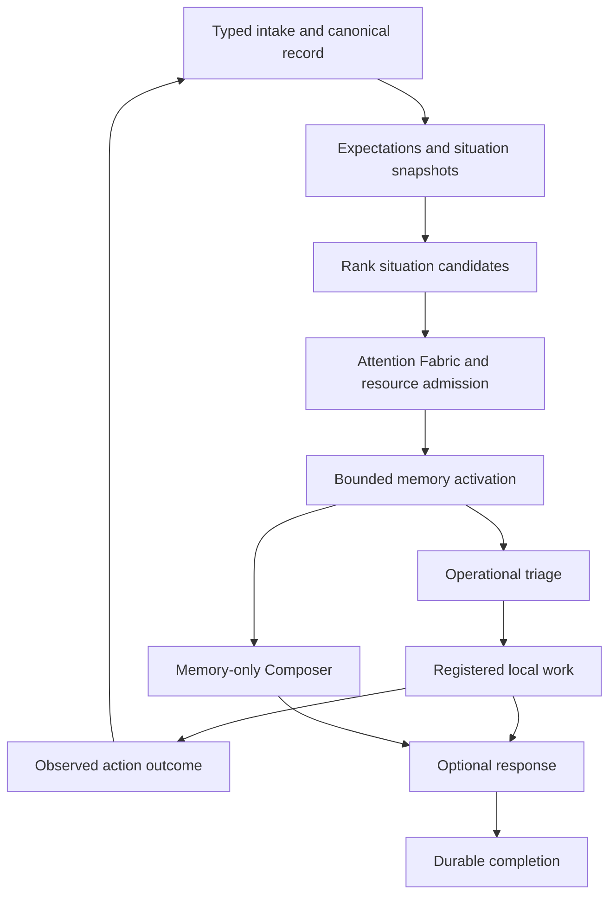

# Situation cognition in v0.8

An admitted observation is canonical evidence. A situation is a bounded, derived
account of related evidence. A task is separately admitted work on a fixed
situation snapshot. Neither a situation nor its salience authorizes an effect.

## Contracts and flow



The six non-user stages are `SITUATION_MEMORY`, `SITUATION_TRIAGE`,
`SITUATION_EXECUTE`, `SITUATION_COMPOSE_MEMORY`, `SITUATION_RESPOND`, and
`SITUATION_PERSIST`. Each runs in a fresh process under `GuardedWorkerLauncher`.
Stage results reach the independent artifact journal before claim completion.
Replacement workers rehydrate completed artifacts instead of repeating inference.

The user pipeline retains its seven v0.7 closure stages. Intake now also forms a
situation before submitting the user task. User response necessity is forced true
at both normalization and application work-disposition boundaries. The current
prompt alone determines historical evidence scope and response surface; salience
and historical text remain quarantined evidence.

## Situation formation and prediction

Adapters supply stable entity, task, goal, causal, and expectation references plus
typed observations. Formation groups by explicit entity references (or observed
subjects), then task references, then correlation identity. Conversation IDs are
provenance, never membership barriers. Multiple entity references allow overlapping
situations. The implementation does not guess entity identity from English phrases.

A worker's CPU, free memory, heartbeat, and lease observations can therefore
produce one situation and one operational task. The resulting discrepancy record
does not assert that resource exhaustion caused the failure without supporting
evidence. Adapter-reported causes are labeled as such.

`Expectation` declares a subject/property, value or range, units, normalization
scale, confidence, validity interval, source, and provenance. Comparisons distinguish
matches, contradictions, range violations, incompatible units/types, expiration,
and observations before validity. Boolean values are not numeric values. NaN and
infinity are rejected. Late evidence remains canonical but cannot replace a newer
observed value. An expectation's confidence reduces its contribution to aggregate
prediction error; it does not establish truth.

Snapshots retain up to 64 percept references, observed properties, expectations,
errors, and relation edges per field, with predecessor links into immutable history.
The model view separately limits observations/errors to 8 and marks incomplete
views. Intake context permits 16 entries per reference/property list. All are
provisional budgets under `SITUATION-PIPELINE-001`.

Salience primarily considers active goals and normalized prediction error, followed
by integrity, threat, task relevance, uncertainty, opportunity, and novelty. English
keyword counts, punctuation, and uppercase text no longer escalate observations.
The bins are provisional. `ROUTINE`, `RECONCILE`, and `EPISODIC_PRIORITY` are
retention hints; no hint deletes or rewrites canonical evidence.

## Non-user work and response policy

`SourcePolicy` is installed through local application configuration. Input payloads
cannot install policies. It fixes allowed kind/modalities, evidence domains,
response necessity, task classes, semantic-triage permission, and maximum urgency.
Unconfigured sources fail closed. An external source cannot self-authorize
consolidation or process control.

Deterministic triage handles explicit schedules, typed discrepancies, and goal/task
references. Only opaque observations from a source configured for semantic triage
use the Percept Triage Specialist. Its entire output is `task_required`,
`candidate_task_class`, `evidence_domains`, and `urgency_class`. Validation prevents
broader evidence access, additional task classes, or urgency beyond the source
ceiling. It cannot retrieve, schedule, execute, generate a response, allocate
resources, modify salience, or decide retention.

The current closed non-user operation catalog contains `OBSERVE`, `RECONCILE`, and
`CONSOLIDATE`. The first two record provenance-bearing observations/discrepancies;
they do not repair an external machine. This bounded catalog makes work selection
deterministic. The v0.7 user capability catalog remains available through its
separate narrow work selector. No generic shell or network executor is introduced.

Responses are optional and application-owned. Structured reports need no model.
When `natural_language_response` and `response_required` are both enabled, the
existing memory-only Composer/Adaptive Recall mechanism and final responder run
in separate guarded processes. Work results reach the final responder directly.
Non-user observations never become the current user instruction: the instruction
is application-authored and evidence remains quarantined.

## Reflexes and action feedback

| Condition checked by its owner | Bounded action | Authority |
| --- | --- | --- |
| Claim-time host/resource gate denies admission | Deny launch and journal the denial | Existing resource policy and fresh host observation |
| Heartbeat is missing or lease expired | Mark lease suspect | Actual durable claim timestamps; does not steal a lease |
| Stored media bytes fail their content hash | Quarantine the reference; preserve bytes | Rehash of the canonical object, not caller-supplied size metadata |
| Declared worker lifetime exceeded | Kill the retained owned process handle and release its claim | Launcher timeout; no input-supplied PID or command |

Each registered local operation first records `ISSUED` and a completion expectation.
A matching executor receipt and read-after-write observation establish `SUCCEEDED`;
an arbitrary event cannot stand in for the receipt. The outcome re-enters intake as
`ACTION_OUTCOME`. Issuance is never reported as completion. A matching outcome does
not reopen an unchanged old discrepancy, preventing autonomous feedback storms.

Reflexes are exercised before semantic deliberation: admission and lifetime handling
are intrinsic to launch, media validation is intrinsic to intake, and the scheduler
tick polls claim liveness. Their actions never depend on salience or model output.

## Modalities and durability

Kinds are `USER_INTERACTION`, `SCHEDULED_EVENT`, `ANOMALY_ALERT`,
`EXTERNAL_OBSERVATION`, `SYSTEM_OBSERVATION`, and `ACTION_OUTCOME`.
Modalities are `TEXT`, `STRUCTURED`, `METRIC`, `IMAGE`, `AUDIO`, `VIDEO`, `FILE`,
`DOCUMENT`, and `EVENT_STREAM`. Interface names remain source metadata.

`preserve_media` streams a local file into content-addressed storage with a 64 MiB
intake bound and records its exact hash, size, and MIME metadata. Media intake
verifies the stored bytes. This is a media transport/provenance implementation;
it does not claim image understanding, speech recognition, or video interpretation.
Extractors should emit separately sourced observations linked to the media receipt.
Event streams accept at most 64 JSON records per delivery; adapters split larger
streams into stable deliveries.

All cognitive records pass through `event_store` and its independent JSON artifacts.
`cognitive_heads` is a disposable index updated by a PostgreSQL trigger in the same
transaction as the canonical event. An event cannot commit without its indexed
head. Explicit rebuilding scans canonical records; ordinary reads use indexed keys
and bounded cursor pages. Raw external observations have their own evidence role;
derived representations cannot masquerade as direct user statements.

## Scheduled consolidation

Consolidation only runs from an explicitly installed schedule. Each task reads one
bounded page of historical situation snapshots and groups observed property values
with supporting percept references and subjects. Duplicate references from
overlapping situations do not increase support. Different values are preserved as
variation, not asserted contradictions between different subjects. The projection
makes no universal claim and retains its source snapshot IDs.

The next cursor is returned for an explicitly scheduled next page. There is no
hidden consolidation call in a responder or user intake, no model memory rewrite,
and no claim of learned procedural skills or biological replay. These derived
projections can be retrieved under the explicit `DERIVED_INTERNAL` evidence scope.

## Local operation

Apply the repository schema through the normal initialization workflow first.
Use JSON files matching the strict models; malformed or overbroad contracts fail
closed. A monitor source configuration, for example, is:

```json
{"source_id":"monitor:worker","kind":"SYSTEM_OBSERVATION","modalities":["STRUCTURED"],"response_required":false,"semantic_triage":false}
```

An input can share `entity_refs: ["worker:1"]` across deliveries and interfaces:

```json
{"source":{"source_id":"monitor:worker","kind":"SYSTEM_OBSERVATION","modality":"STRUCTURED","interface":"health-monitor"},"delivery_id":"sample-1","observed_at":"2026-09-12T12:00:00Z","observation":{"cpu_percent":98},"context":{"entity_refs":["worker:1"],"observations":[{"subject":"worker:1","property":"cpu_percent","value":98}]}}
```

```bash
uv run python -m jit_agent.percept_cli install-source source.json
uv run python -m jit_agent.percept_cli expectation expectation.json
uv run python -m jit_agent.percept_cli ingest sample.json
uv run python -m jit_agent.percept_cli schedule-consolidation schedule.json
uv run python -m jit_agent.percept_cli tick
uv run python -m jit_agent.percept_cli situations
```

Expectations require their explicit validity interval and provenance references;
omit the expectation command when no expectation is supplied. Schedules require
`schedule_id`, `due_at`, and optional `after_key`. `tick` performs one bounded poll
and processes currently admitted situation tasks. Repeated ticks advance cursor
pages and queued work. Run it from the local supervisor at the cadence appropriate
for installed adapters; this change does not install an OS service or external timer.

`rebuild-heads` is an explicit offline recovery command. Stop workers before using
it. It changes only the disposable index, leaving canonical events and artifacts intact.
