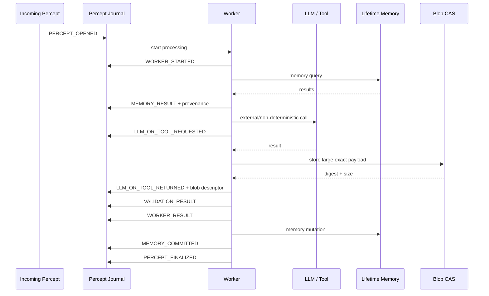
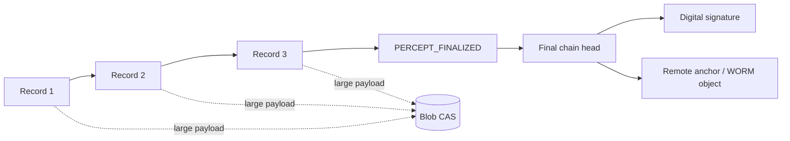
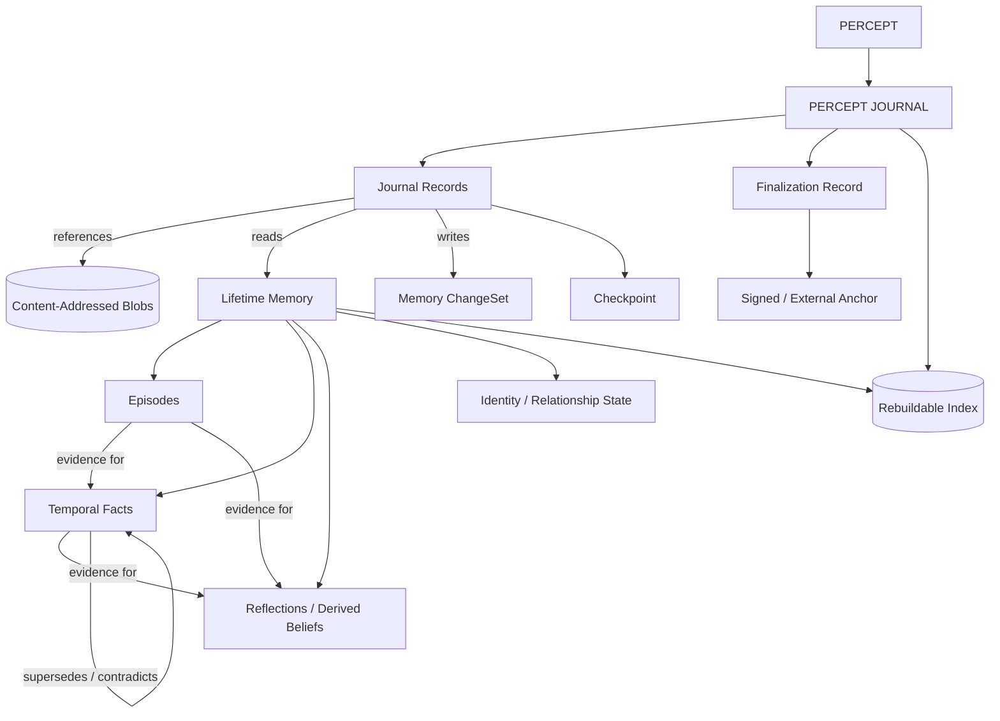
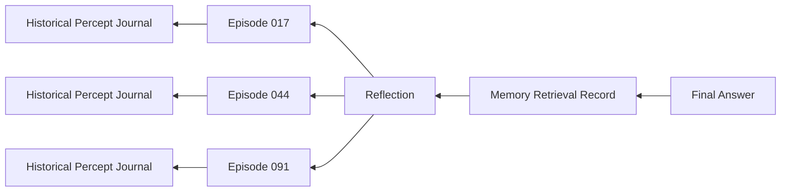

# Persistent Agent Memory, Durable Execution, and Forensic Provenance: Patterns Prometheist Should Borrow

## Executive summary

The research strongly supports the architecture we have been converging on, with one important refinement:

> **Prometheist should treat a percept as the unit of durable causal history, not a worker, stage, LLM call, database row, or filesystem artifact.**

The closest mature precedent is not an agent-memory framework at all. It is **Temporal**. Temporal maintains one append-only Event History for a workflow execution, records externally obtained/non-deterministic results so recovery can replay from history instead of repeating them, and now supports externalizing large payloads to object storage while leaving references in the history. Its external-payload documentation explicitly discusses content-addressed keys such as SHA-256 for deduplication. citeturn14view2turn15view1 That is remarkably close to the proposed Prometheist design:

```text
Percept
   │
   ▼
Append-only Percept Journal
   │
   ├── cognition records
   ├── memory reads/writes
   ├── LLM/tool requests and returns
   ├── validation results
   ├── persistence commits
   ├── checkpoints/recovery state
   │
   └── references ──────────► Content-addressed blobs
```

No agent-memory project I examined has all of the properties Prometheist wants in one coherent architecture. The useful solution is therefore **compositional**:

| Prometheist need | Strongest source of ideas |
|---|---|
| Per-percept append-only causal history | **Temporal** |
| Checkpoints, partial-success durability, state forks | **LangGraph** |
| Blob/CAS references | **OCI content descriptors + Temporal external payloads** |
| Hash chaining / tamper evidence | **SuperLocalMemory**, but reimplement and strengthen it |
| Episodic versus semantic memory | **Soar** |
| Temporal facts and provenance to source episodes | **Graphiti** |
| Multi-signal retrieval and additive memory | **Mem0** |
| Recency/relevance/importance retrieval + reflection | **Generative Agents 2023** |
| Human-fidelity methodology and source-linked reflections | **Stanford 1,000-person Generative Agents** |
| Tiered consolidation/promotion | **MemoryOS** |
| Editable durable identity/context + run/step correlation | **Letta/MemGPT** |
| Memory changesets / branches | **OpenCog AtomSpace** |

The two Stanford studies are especially useful when considered together. The **2023 Generative Agents** work asks, in effect, “How can an agent accumulate experiences, retrieve them, reflect on them, and behave coherently over time?” Its memory retrieval combines recency, semantic relevance, and importance, while reflection turns lower-level experiences into higher-level memories. citeturn12academia42 The public implementation makes those dimensions explicit and combines normalized recency, relevance, and importance scores. fileciteturn10file0

The later **1,052-person Generative Agent Simulations** study asks the question much closer to Prometheist's identity goal: “Can a computational agent reproduce the responses and behavior of a particular real person?” It constructs agents from qualitative interviews and evaluates them across survey responses, personality measures, and behavioral experiments; the paper reports performance equivalent to 85% of participants' own two-week test-retest replication accuracy on the General Social Survey. citeturn12academia39 Its open-source `genagents` implementation also gives reflections direct pointers back to the memories from which they were derived—a simple provenance idea that Prometheist should generalize aggressively. The repository is MIT-licensed. fileciteturn25file0

The highest-value memory innovation to borrow outside Stanford is probably **Graphiti's temporal/provenance model**. Graphiti distinguishes raw ingested episodes from derived entities and facts; facts have temporal validity windows, superseded information is retained rather than simply erased, and derived information remains traceable to its source episodes. Retrieval combines semantic, keyword/BM25, and graph signals. fileciteturn5file0 This maps exceptionally well onto Prometheist's need to distinguish:

```text
What actually happened?
        │
        ▼
EPISODE / OBSERVATION
        │
        ├──► derived belief
        ├──► inferred preference
        ├──► relationship fact
        └──► self-model conclusion
```

A derived belief must never quietly become indistinguishable from the evidence that caused it.

The most important audit lesson comes from **SuperLocalMemory**, but it is partly a lesson in what **not** to copy. Its current implementation uses an independent SQLite audit database, SHA-256 hash chaining, and an external sidecar containing chain length and head hash to detect truncation. fileciteturn8file0 Its integrity verifier walks the chain and checks both predecessor links and computed hashes. fileciteturn9file0 That is directionally right.

However, inspection of the implementation reveals two weaknesses relevant to Prometheist. First, its audit-event hash covers operation, actor/profile IDs, content hash, timestamp, and previous hash—but **does not cover the free-form metadata field**. Thus metadata can be altered without invalidating the hash chain. Second, its truncation “anchor” is an adjacent writable sidecar file; an actor able to rewrite both the audit database and the sidecar can restate the history. fileciteturn8file0 Prometheist should therefore hash the **canonicalized complete semantic record**, then externally sign or anchor finalized journal heads in another trust domain. SuperLocalMemory itself correctly warns that hash chaining is tamper-*evident*, not tamper-proof. fileciteturn7file2 Its AGPL-3.0 license is another reason to borrow the architecture rather than copy its implementation. fileciteturn23file0

My resulting recommendation is:

> **Build a Prometheist-native Percept Journal rather than adopting Temporal, LangGraph, Letta, Mem0, Graphiti, or another framework wholesale. Borrow specific proven mechanisms from each.**

The production target should have four fundamental persistent structures:

```text
1. Percept Journal
   One append-only logical causal stream per percept.

2. Content-Addressed Blob Store
   Exact large/binary payloads addressed by cryptographic digest.

3. Lifetime Memory
   Episodes, facts, reflections, identity state, relationships, commitments,
   preferences, knowledge, etc., each carrying provenance.

4. Rebuildable Indexes / Projections
   PostgreSQL/vector/graph/search structures optimized for queries but not
   treated as the sole historical truth.
```

Tests, benchmarks, experiments, CLI interactions, email, sensor input, timers, tool callbacks, scheduled tasks, and production percepts should all go through this same infrastructure. Development should not have a privileged alternate artifact system.

## Comparative landscape

The following comparison emphasizes features that can realistically contribute to Prometheist rather than general agent-framework functionality.

| Project | License | Key features | Adoptable components | Risk / notes |
|---|---|---|---|---|
| **[Temporal](https://github.com/temporalio/temporal)** | MIT fileciteturn18file0 | Append-only workflow Event History; deterministic replay; recorded side effects; recovery; large-payload external storage; encryption codecs; workflow/run identity | **Percept Journal semantics**, replay discipline, capture-before-recovery of nondeterministic results, external payload references, principal attribution, history rollover concepts | Adopting Temporal itself would add substantial server/runtime infrastructure. Borrow the model unless Prometheist eventually needs distributed workflow orchestration. citeturn14view2turn15view0turn15view1 |
| **[LangGraph](https://github.com/langchain-ai/langgraph)** | MIT fileciteturn17file0 | Thread checkpoints; state history; pending writes; replay/time travel; SQLite/Postgres/MongoDB checkpointers; long-term Store; namespaces; optional encrypted serialization | Meaningful recovery checkpoints, durable completed sibling work, worker/subgraph namespaces, state forks, pluggable persistence | Replay after a checkpoint can re-execute later LLM/API work; Prometheist must be stricter around irreversible external effects. Checkpoint model should supplement—not replace—the journal. citeturn14view0turn16view0turn16view1turn16view2turn16view3 |
| **[Graphiti](https://github.com/getzep/graphiti)** | Apache-2.0 fileciteturn6file0 | Temporal knowledge graph; source episodes; fact validity windows; historical preservation; provenance; semantic + BM25 + graph retrieval; incremental updates | **Episode→fact provenance**, temporal/supersession model, hybrid retrieval, entity/relationship memory | Full integration currently brings graph DB requirements and structured-output-sensitive ingestion. Small local models may make direct adoption less robust than porting the data model first. fileciteturn5file0 |
| **[Letta / MemGPT / Letta Code](https://github.com/letta-ai/letta-code)** | Apache-2.0 fileciteturn16file0 | Stateful agent memory; memory blocks; persisted messages/reasoning/tool calls; MemFS Git history; dreaming; CLI; permissions; remote execution; run/step IDs | Human-readable curated memory, Git-versioned editable identity/context, run/step correlation, message/tool provenance, idempotent interaction semantics, background consolidation | Git is useful for curated editable memory but a poor primary high-volume causal ledger. The product is evolving rapidly. fileciteturn15file0 citeturn20view0turn21view0turn21view1 |
| **[Mem0](https://github.com/mem0ai/mem0)** | Apache-2.0 fileciteturn26file0 | Long-term memory CRUD/history; user/agent/run scoping; semantic/entity/keyword retrieval; temporal reasoning; self-hosted engine; current ADD-oriented extraction | Additive memory semantics, namespace conventions, multi-signal retrieval, memory-history API, token-budget evaluation | Managed Mem0 and OSS Mem0 do not have identical features/performance; global project-wide event auditing is stronger in the managed platform than OSS. citeturn18search0turn18search1turn18search3turn18search4 |
| **[Generative Agents 2023](https://github.com/joonspk-research/generative_agents)** | Apache-2.0 fileciteturn24file0 | Natural-language experience stream; recency/relevance/importance retrieval; reflection; planning; agent simulation; ablation experiments | Retrieval scoring decomposition, importance/“poignancy,” reflection pipeline, component ablation methodology | Research/simulation code, not durable infrastructure; tied to Smallville assumptions and older API/output patterns. Borrow algorithms, not architecture wholesale. citeturn12academia42 fileciteturn10file0 |
| **[Stanford genagents / 1,000-person study](https://github.com/StanfordHCI/genagents)** | MIT fileciteturn25file0 | Interview-derived real-person agents; observation/reflection memory stream; source pointers for reflections; fidelity studies across survey/personality/behavior | **Identity-fidelity methodology**, source-linked derived memories, interview ingestion, cross-domain/person-level evaluation, subgroup/bias analysis | Research prototype; actual participant agents are constrained by privacy. Very valuable experimentally, less useful as infrastructure. citeturn12academia39 |
| **[MemoryOS](https://github.com/BAI-LAB/MemoryOS)** | Apache-2.0 in project distribution | Short-, mid-, long-term memory; promotion/consolidation; “heat” from use/interaction; user profile and knowledge; Chroma/MCP/local model support | Tiered consolidation, heat/activation as a promotion signal, separate user-profile versus factual knowledge | Weak forensic/audit model relative to Prometheist. Treat its consolidation ideas as research algorithms rather than storage architecture. fileciteturn12file0 citeturn12academia41 |
| **[Soar](https://github.com/SoarGroup/Soar)** | BSD-family | Decades-mature cognitive architecture; episodic memory; semantic memory; SQLite persistence; precise retrieval; highly configurable tracing | **Episodic/semantic separation**, automatic episode capture, mutable working instances of durable knowledge, audit verbosity levels | Not an LLM-agent framework and not cryptographically auditable; concepts are more useful than direct integration. citeturn9view0turn10view0turn10view1 |
| **[SuperLocalMemory](https://github.com/qualixar/superlocalmemory)** | AGPL-3.0 fileciteturn23file0 | Local-first memory; separate audit DB; SHA-256 chain; truncation anchor; RBAC audit; provenance; governed writes; CLI/MCP | Hash-chain architecture, independent audit persistence, head/count anchors, governed write/completion concepts, separation of canonical data from projections | **Do not copy code casually because of AGPL.** Current hash excludes metadata, and local sidecar anchor is not an independent trust root. Reimplement stronger design. fileciteturn8file0 fileciteturn9file0 |
| **[OpenCog AtomSpace](https://github.com/opencog/atomspace)** | AGPL-3.0 + linking exception fileciteturn13file0 | Hypergraph knowledge representation; immutable atoms; persistence modules; Frames/ChangeSets resembling graph commits | Memory changesets, branching/forking conceptual model, immutable identity versus mutable values | AGPL and large conceptual/runtime surface. Use as design prior art, not dependency. Its Frames are explicitly described as roughly analogous to Git commits for graph state. fileciteturn14file0 |
| **[OCI Image Specification](https://github.com/opencontainers/image-spec)** | Apache-2.0 fileciteturn20file0 | Content-addressed descriptors; digest + size + media type; verification; Merkle-DAG composition | **Blob descriptor format and CAS semantics** almost directly | Not an agent project—which is an advantage here. Mature, narrow, and battle-tested content-addressing concepts. fileciteturn19file0 |

There is no compelling reason to import an entire foreign framework merely to acquire one of these features. Most of the highest-value patterns are small enough to implement natively.

Licensing also makes a natural cut. Temporal, LangGraph, Graphiti, Letta, Mem0, both Stanford repositories, and OCI are MIT/Apache-style sources from which code can be adapted much more comfortably, subject to their attribution/notice requirements. SuperLocalMemory and OpenCog are AGPL-family projects and should primarily be treated as **architectural references** unless Prometheist deliberately chooses the licensing consequences. fileciteturn18file0 fileciteturn17file0 fileciteturn6file0 fileciteturn16file0 fileciteturn26file0 fileciteturn24file0 fileciteturn25file0 fileciteturn23file0 fileciteturn13file0

## Memory architectures worth borrowing

The useful question for each memory project is not merely “Does it remember?” It is:

> What representation does it preserve, how does it derive higher-level knowledge, how does retrieval work, and can an auditor travel backward from a model-visible memory to the evidence that created it?

That produces some clear winners.

### The two Stanford Generative Agents systems

The original Generative Agents architecture has three ideas that remain extremely good.

First, **experiences become durable memory records instead of remaining only inside the LLM's context window**. Second, memory retrieval is not pure vector similarity. The implementation separately calculates recency, importance, and embedding-based relevance, normalizes them, and combines them into a ranking. fileciteturn10file0 Third, reflection creates higher-level thoughts from groups of lower-level memories, making synthesized understanding itself retrievable. The paper's ablation experiments showed that observation, planning, and reflection each contribute to agent behavior rather than reflection merely being decorative machinery. citeturn12academia42

That suggests a Prometheist ranking model with more dimensions than the Stanford baseline:

\[
S(m,q)=
w_rR+
w_sS+
w_iI+
w_tT+
w_pP+
w_cC+
w_eE
\]

where, for example:

- \(R\) = recency;
- \(S\) = semantic relevance;
- \(I\) = importance/salience;
- \(T\) = temporal applicability;
- \(P\) = provenance/source quality;
- \(C\) = causal/contextual relevance;
- \(E\) = identity/entity relevance.

The important point is **not** that those weights should be hard-coded. Prometheist should journal the component scores and the retrieval-policy version so that a later auditor can answer why memory A was shown to a worker while memory B was not.

The later Stanford `genagents` implementation is interesting because its `ConceptNode` distinguishes observations from reflections and stores a pointer from a reflection to the source records that produced it. Its retrieval implementation again separates recency, importance, and relevance; `reflect()` retrieves source records, generates new reflections, scores them, and stores source IDs with the derived reflections. That is exactly the sort of provenance Prometheist needs, generalized beyond reflection. fileciteturn1file0 fileciteturn2file0

Prometheist should therefore represent:

```text
Direct observation
    "Mike said X."
        │
        ├───────────────┐
        ▼               ▼
Derived preference    Relationship inference
    "Mike appears       "X is associated
     to prefer Y."       with person Z."
        │
        ▼
Higher-order reflection
    "Across several contexts,
     preference Y is stable."
```

Every downward edge should be a durable `derived_from` relationship.

The **1,052-person study** contributes something different: methodology. Rather than asking only whether memory retrieval succeeds, it asks whether a generated person remains faithful to the actual individual across qualitatively different evaluations. It uses interview-derived person representations and compares agents on survey, personality, and behavioral tasks; it also analyzes differences across demographic and ideological groups. citeturn12academia39

That gives PERSON-FIDELITY and future Prometheist benchmarks a much stronger template:

```text
Identity source corpus
        │
        ▼
Prometheist memory formation
        │
        ▼
Held-out evaluation domains
   ┌────┼────────┬─────────┐
   ▼    ▼        ▼         ▼
values personality choices novel situations
   │    │        │         │
   └────┴────────┴─────────┘
             │
             ▼
person-level fidelity
+ stability
+ uncertainty calibration
+ subgroup/error analysis
```

A system that memorizes answers to one benchmark is not person-fidelity. The Stanford work gives us a way to evaluate *generalization of identity*.

There is also a privacy lesson. The researchers released the framework but restrict access to actual participant agent data rather than simply publishing complete human representations. citeturn12academia39 That reinforces a policy Prometheist should establish early: **benchmark mechanics may be public; real-person autobiographical memory and its raw percept evidence should live in a separate privacy domain.**

### Graphiti: probably the strongest memory data model

Graphiti's most important contribution is not merely “knowledge graphs.” It is the separation between:

```text
EPISODE
raw source material as ingested
        │
        ▼
ENTITY / RELATIONSHIP EXTRACTION
        │
        ▼
TEMPORAL FACT
derived claim with validity information
```

Graphiti explicitly preserves episodes as provenance, lets facts carry validity windows, invalidates superseded facts instead of deleting history, and supports historical queries. It combines semantic retrieval with keyword/BM25 and graph traversal. fileciteturn5file0

Prometheist should adopt the semantics even if it does **not** initially adopt Graphiti or a graph database.

For example:

```json
{
  "memory_id": "fact_01...",
  "kind": "derived_fact",
  "subject": "person:mike",
  "predicate": "preferred_food",
  "object": "ramen",
  "asserted_at": "2026-09-23T18:22:41Z",
  "valid_from": "2026-09-01T00:00:00Z",
  "valid_until": null,
  "confidence": 0.83,
  "derived_from": [
    "episode_29...",
    "episode_84..."
  ],
  "derivation_method": "preference-consolidator/v3"
}
```

If evidence later changes:

```text
fact_01  valid until 2026-10-11
fact_02  valid from 2026-10-11
```

Do **not** overwrite `fact_01` as though Prometheist had always believed the newer fact.

This matters enormously for a personal agent. People change. Relationships change. Jobs change. Preferences change. Beliefs change. An identity system that only stores the latest value destroys autobiographical information.

### Mem0: additive memory and retrieval fusion

Current Mem0 is useful for a different reason: it has moved toward an **additive extraction model** in which newly extracted memories accumulate instead of making the extraction step responsible for aggressively rewriting or deleting previous ones. Its current open-source project also supports memory history and user/agent/run scoping, while retrieval increasingly combines multiple signals rather than vector similarity alone. citeturn18search1turn18search3turn18search4

That is a good fit for Prometheist:

```text
Evidence arrives
      │
      ▼
ADD new memory/evidence
      │
      ▼
separate reconciliation process
      │
      ├── supersedes
      ├── corroborates
      ├── contradicts
      ├── narrows
      └── leaves unresolved
```

I would prefer that over “new extraction silently edits old memory.”

Mem0 also gives us useful namespace conventions: person/user identity, agent identity, and run identity are separate dimensions. citeturn18search3 Prometheist should go slightly further:

```text
identity/person
project or installation
environment
percept
worker
memory domain
security domain
```

The warning is that Mem0's managed platform and its OSS implementation are not identical products; some global governance/event-feed functionality belongs to the managed offering. citeturn18search3 We should borrow its memory algorithms without assuming its open-source package solves Prometheist's provenance requirements.

### MemoryOS, Letta, and Soar: consolidation, editing, and memory classes

MemoryOS is strongest as a model of **promotion and consolidation**. Its architecture separates short-, mid-, and long-term stores. Conversations initially occupy short-term memory, are consolidated into mid-term segments, and accumulated “heat” based on factors such as visitation/interaction can trigger analysis and long-term profile/knowledge updates. Its current implementation supports local deployment pathways including vLLM-compatible configurations. fileciteturn12file0

The Prometheist version should not blindly copy the physical tiers. Instead:

```text
new episodes
    │
    ▼
activation / recurrence / importance accumulates
    │
    ▼
consolidation candidate
    │
    ▼
derive durable semantic or identity memory
    │
    ▼
retain original episodes + derivation links
```

“Heat” is a useful signal, but it should be only one reason for consolidation. Identity relevance, contradiction, emotional/salience importance, novelty, recurring entities, and long-term utility can all contribute.

Letta gives a complementary lesson: some memory should be **deliberately editable and human-readable**. Letta Code's MemFS tracks agent context—including memory blocks—in Git, while the system can keep some memory continuously in context and other material loadable on demand. Letta also preserves messages/tool calls outside the active context and identifies execution through run/step concepts. fileciteturn15file0 citeturn20view0turn21view0turn21view1

I would therefore distinguish:

```text
Autobiographical/event memory
    append-derived, provenance heavy
    not casually hand-edited

Semantic/identity model
    derived but auditable

Curated governing context
    explicitly editable
    human-readable
    Git-versionable

Working memory
    ephemeral current cognitive state
```

Git is appropriate for the third category, not for the first.

Soar has been making essentially this distinction for decades. Its architecture separates episodic memory—a historical stream of experience—from semantic memory—long-term declarative knowledge—and can persist them to SQLite. Its trace facilities can expose different degrees of internal activity for debugging. citeturn9view0turn10view0turn10view1

That is a surprisingly strong precedent for Prometheist:

> **Do not force episodic history, semantic knowledge, working state, and audit trace to be the same data structure.**

They should link to one another, but each has different semantics.

## Execution persistence, audit, and provenance

Persistent memory answers **what Prometheist remembers**.

A Percept Journal must answer **what Prometheist did**.

Those are separate problems.

### Temporal validates the one-journal-per-percept model

Temporal's Workflow Event History is an append-only sequence covering the execution lifecycle. Temporal uses that history to reconstruct workflow state after failure rather than relying exclusively on a mutable snapshot. The history also serves as an execution/debugging record. citeturn14view2

The essential pattern maps almost one-to-one:



The critical recovery rule should be:

> Once an external/non-deterministic result has been durably journaled, recovery consumes that recorded result instead of silently performing the operation again.

That includes:

- LLM generations;
- HTTP requests with side effects;
- emails/messages sent;
- filesystem writes;
- payments or purchases eventually;
- model/tool outputs;
- random choices when semantically significant;
- wall-clock observations when relevant;
- external sensor readings.

Temporal's side-effect/event-history model exists precisely because replaying nondeterministic operations as though nothing had happened produces divergent execution. citeturn14view2

Temporal's newer external-storage mechanism is also highly relevant. Large payloads may be offloaded from workflow history, while the history retains an external reference; its documentation explicitly discusses content-addressable SHA-256-style keys as a deduplication strategy. citeturn15view1

That is essentially the exact Prometheist journal/CAS split we have been discussing.

### LangGraph shows where checkpoints belong

LangGraph's checkpointer saves state at graph super-step boundaries and supports retrieving state history, resuming execution, replay/time travel, and durable “pending writes” so output from nodes that succeeded need not be recomputed merely because a sibling failed. citeturn16view0turn16view1turn16view2

Prometheist should borrow **pending-write semantics**.

Suppose:

```text
Worker A ───── succeeds ───► durable result
Worker B ───── succeeds ───► durable result
Worker C ───── crashes
```

Recovery should be:

```text
reuse A
reuse B
resume/retry C
```

not:

```text
rerun A
rerun B
rerun C
```

That is both more efficient and more auditable.

But Prometheist should **not** make checkpoints the historical truth. A checkpoint says:

> “Here is the state after step X.”

The journal says:

> “Here is exactly how we got to the state after step X.”

So:

```text
Percept Journal       canonical causal history
       │
       ├── checkpoint record ──► resumable state
       ├── checkpoint record ──► resumable state
       └── finalization
```

LangGraph's hierarchy through `checkpoint_ns` is also worth adapting for nested workers/subgraphs, and its distinction between SQLite for lightweight/local use and stronger production backends confirms that execution persistence does not inherently demand industrial-scale infrastructure. citeturn14view0turn16view1turn16view3

### SuperLocalMemory demonstrates hash chaining—and an important trap

SuperLocalMemory's audit subsystem deserves unusually close inspection because it is one of the few memory projects implementing an actual hash-chain audit mechanism.

Its audit chain lives in an independent SQLite connection rather than sharing the main memory database. Entries include operation, agent/profile IDs, a content hash, predecessor hash, event hash, timestamp, and metadata. A sidecar anchor records the chain's current count and head, allowing its verifier to detect a truncated suffix in addition to ordinary modified records. fileciteturn8file0 The verifier walks the sequence and recomputes hashes. fileciteturn9file0

That gives three good patterns:

```text
independent audit persistence
+
hash-linked sequence
+
external head/count anchor
```

But the implementation also illustrates why “we use a blockchain-like hash chain” is not enough.

The event-hash calculation does **not** incorporate the free-form `metadata` field. Therefore:

```text
hashed operation       protected
hashed content hash    protected
hashed timestamp       protected

metadata               NOT protected by event hash
```

An attacker or corruption event could change metadata without breaking the chain. fileciteturn8file0

Prometheist should instead calculate something logically equivalent to:

```text
record_hash =
    SHA256(
        canonical_serialization(
            complete_record_except_record_hash
        )
    )
```

where `prev_hash` is itself one of the canonicalized fields.

That causes every record to commit to:

```text
all semantic fields in this record
+
the complete chain that preceded it
```

The second issue is the anchor. A local sidecar next to a local SQLite database helps detect accidental truncation, but it is not a separate trust domain. A sufficiently privileged actor can rewrite both.

A stronger hierarchy is:



For ordinary local development, the chain alone is enough to detect accidental corruption. For serious hostile-auditor guarantees, finalization should additionally sign the journal head or publish it to storage whose credentials/immutability policy are independent of the process that wrote the journal.

That is **tamper evidence**, not magical tamper prevention.

### OCI gives us the blob reference we should probably use

The OCI image specification has already solved the basic content-addressed descriptor problem. Its descriptor includes a media type, content digest, and exact byte size; content retrieved from elsewhere can be verified against both size and digest. SHA-256 support is mandatory in the specification. fileciteturn19file0

There is little value in Prometheist inventing a stranger representation.

A journal blob reference could simply be:

```json
{
  "mediaType": "application/json",
  "digest": "sha256:8f47c1...",
  "size": 18442
}
```

For a PDF:

```json
{
  "mediaType": "application/pdf",
  "digest": "sha256:36b599...",
  "size": 8192471
}
```

For audio:

```json
{
  "mediaType": "audio/flac",
  "digest": "sha256:f9e831...",
  "size": 48192114
}
```

The **digest identifies bytes**. A human filename can exist as metadata, but it should not determine identity.

### OpenCog and Soar supply older cognitive-computing precedents

OpenCog's Frames/ChangeSets are described by the AtomSpace project as collections of graph changes roughly resembling Git commits for a graph database. fileciteturn14file0 This suggests a later Prometheist concept worth preserving in the data model:

```text
memory transaction
    ├── add episode
    ├── add fact
    ├── invalidate old fact
    ├── add relationship
    └── update activation
```

can itself be represented as one logical changeset.

That would let the Percept Journal say:

```json
{
  "record_type": "MEMORY_CHANGESET_COMMITTED",
  "changeset_id": "mc_...",
  "caused_by_record_id": "pr_..."
}
```

rather than pretending every row mutation is an independent cognitive event.

Soar reinforces the complementary idea that an execution trace can have different *views* or verbosity levels without changing the underlying cognitive memory. citeturn10view0 Prometheist should similarly maintain one canonical journal and expose:

```text
audit --summary
audit --timeline
audit --workers
audit --models
audit --memory
audit --external-effects
audit --full
```

Those are views, not separate historical artifact sets.

## Recommended Prometheist target architecture

The research points toward a target architecture that is simpler physically than the current artifact store but more rigorous semantically.

### Canonical entities



The boundaries matter.

**The journal is causal truth.** It tells us what occurred while processing a percept.

**Lifetime memory is cognitive state.** It tells us what the agent remembers/knows/believes.

**The CAS is byte storage.** It preserves large exact inputs and outputs without multiplying them across artifacts.

**Indexes are projections.** PostgreSQL indexes, vector indexes, full-text indexes, graph projections, dashboards, and search tables should ideally be reconstructable from canonical data.

### A Prometheist journal record

A common JSONL envelope could look like:

```json
{
  "schema": "prometheist.percept-journal.record/v1",
  "percept_id": "pt_01K5...",
  "seq": 17,
  "record_id": "jr_01K5...",
  "record_type": "LLM_RETURNED",
  "occurred_at": "2026-09-23T22:41:18.912Z",

  "producer": {
    "component": "response-worker",
    "component_version": "3.2.0"
  },

  "actor": {
    "type": "worker",
    "id": "response"
  },

  "correlation": {
    "caused_by": "jr_01K5_request...",
    "attempt": 1
  },

  "payload": {
    "model": {
      "provider": "local",
      "model_id": "qwen3:4b-instruct-2507-q4_K_M",
      "model_digest": "sha256:..."
    },
    "response": {
      "mediaType": "application/json",
      "digest": "sha256:c814...",
      "size": 18297
    },
    "finish_reason": "stop"
  },

  "prev_hash": "sha256:87ab...",
  "record_hash": "sha256:5b2f..."
}
```

The journal should establish a **canonical byte serialization** for hashing. Everything semantically relevant—including fields normally dismissed as “metadata”—must be inside the hash commitment.

An LLM lifecycle can then be represented without separate physical artifacts:

```jsonl
{"seq":12,"record_type":"LLM_REQUESTED", ...}
{"seq":13,"record_type":"LLM_RETURNED", ...}
{"seq":14,"record_type":"LLM_VALIDATION_PASSED", ...}
{"seq":15,"record_type":"WORKER_RESULT", ...}
```

A failed attempt remains equally transparent:

```jsonl
{"seq":12,"record_type":"LLM_REQUESTED","attempt":1,...}
{"seq":13,"record_type":"LLM_RETURNED","attempt":1,...}
{"seq":14,"record_type":"LLM_VALIDATION_FAILED","attempt":1,...}
{"seq":15,"record_type":"LLM_REQUESTED","attempt":2,...}
{"seq":16,"record_type":"LLM_RETURNED","attempt":2,...}
{"seq":17,"record_type":"LLM_VALIDATION_PASSED","attempt":2,...}
```

That is **six observable immutable facts and still only one journal file**.

### Finalization

The final record should permanently close the journal:

```json
{
  "schema": "prometheist.percept-journal.record/v1",
  "percept_id": "pt_01K5...",
  "seq": 41,
  "record_id": "jr_01K5_final...",
  "record_type": "PERCEPT_FINALIZED",
  "occurred_at": "2026-09-23T22:41:23.118Z",

  "payload": {
    "disposition": "RESPONDED",
    "records_before_finalization": 41,
    "output_record_id": "jr_01K5_response...",
    "memory_changeset_ids": [
      "mc_01K5..."
    ]
  },

  "prev_hash": "sha256:...",
  "record_hash": "sha256:..."
}
```

The `record_hash` of that terminal record becomes the final journal head.

An external anchor can then state:

```json
{
  "percept_id": "pt_01K5...",
  "journal_head": "sha256:...",
  "record_count": 42,
  "finalized_at": "2026-09-23T22:41:23.118Z",
  "signing_key_id": "prometheist-audit-2026-01",
  "signature": "ed25519:..."
}
```

The signature/remote anchor is not necessary for basic crash recovery. It is an **audit-strengthening layer**.

### Memory provenance should be first-class

Borrowing from Graphiti and Stanford, a reflection should never be an anonymous string in a vector database.

It should look more like:

```json
{
  "memory_id": "mem_reflection_...",
  "memory_type": "reflection",
  "content": "Mike tends to prefer direct criticism to reassuring agreement.",
  "derived_from": [
    "episode_017",
    "episode_044",
    "episode_091"
  ],
  "created_by_percept": "pt_01K5...",
  "created_by_record": "jr_01K5...",
  "derivation_policy": "identity-consolidation/v2",
  "confidence": 0.88,
  "status": "active"
}
```

Then a future answer can be audited backwards:



That is the difference between **persistent memory** and **causally accountable persistent memory**.

### Storage and scaling

Initially, one physical JSONL journal per percept remains a very good design:

```text
artifact-store/
├── journals/
│   └── 2026/
│       └── 09/
│           └── 23/
│               ├── 20260923T224101Z__user-prompt__pt_01K5....pjl
│               └── 20260923T224319Z__scheduled-task__pt_01K5....pjl
│
├── blobs/
│   └── sha256/
│       ├── 36/
│       │   └── 36b599...
│       └── c8/
│           └── c814...
│
├── anchors/
│   └── 2026/09/23/...
│
└── indexes/
    └── local-index.db
```

But the API should promise **one logical journal stream per percept**, not eternal one-file-per-percept implementation.

At larger scale:

```text
logical journals
       │
       ▼
immutable packed segments
       │
       ├── journal A: bytes 0–18442
       ├── journal B: bytes 18443–29318
       └── journal C: bytes 29319–...
```

The index maps `percept_id` to segment/range.

Temporal's own Event History limits and rollover concepts are a useful warning that execution histories can eventually become pathological if allowed to grow forever. citeturn14view2 Most Prometheist percepts should remain tiny by comparison; an extremely long-running percept can later be continued as a causally linked successor rather than creating an unbounded file.

For CAS security, I would **not globally deduplicate private material across unrelated security domains**. A global content hash allows equality/presence inference: two tenants with the same digest reveal that they possess identical bytes. Deduplication should therefore be scoped by person/project/confidentiality domain unless that leak is acceptable.

The same principle applies to remote storage. Public synthetic benchmark blobs and real-person autobiographical blobs should not merely be different directories under identical public credentials.

A sensible hierarchy is:

```text
public/synthetic
private/person/<person-id>
private/system
restricted/secrets-adjacent
```

with separate IAM policies and encryption keys where warranted.

Secrets themselves should generally **not** be journaled. The journal should record an opaque credential reference and the fact that a credential was used, not its plaintext. Even hashing a secret can leak equality and make offline guessing possible for low-entropy values.

For privacy-erasure requirements, the architecture should also avoid forcing sensitive plaintext into the immutable journal envelope. Put sensitive payloads in encrypted blobs and keep only necessary non-sensitive provenance in the journal. Then future authorized erasure can destroy a blob/key while retaining a skeletal audit fact such as “a now-erased private document influenced this operation.” SuperLocalMemory's explicit retention, PII, RBAC, and erasure concerns demonstrate that long-lived memory systems eventually have to confront those lifecycle issues. fileciteturn7file8

## Human auditing and operational tooling

A causal journal is only useful if a human can understand it.

I would **not** persist a separate `audit.md` for every percept by default. Generate it deterministically from the journal and its referenced records:

```text
prometheist audit percept pt_01K5...
```

could produce:

```markdown
# Percept Audit

Percept: pt_01K5...
Type: USER_PROMPT
Opened: 2026-09-23 22:41:14.102 UTC
Finalized: 2026-09-23 22:41:23.118 UTC
Disposition: RESPONDED

Integrity
---------
Journal records: 42
Hash chain: PASS
Referenced blobs: 6/6 VERIFIED
Final head: sha256:5b2f...
External signature: VALID
Schema: percept-journal/v1

Input
-----
Source: CLI
Actor: Mike
Payload: sha256:9c31...
Size: 1,842 bytes

Timeline
--------
00:00.000  PERCEPT_OPENED
00:00.014  REFERENCES_RESOLVED          3 references
00:00.027  EVIDENCE_POLICY_STARTED
00:00.031  LLM_REQUESTED                attempt 1
00:00.812  LLM_RETURNED                 734 tokens
00:00.817  LLM_VALIDATION_PASSED
00:00.821  WORKER_RESULT                historical evidence permitted

00:00.833  MEMORY_QUERY                 candidate pool: 211
00:00.851  MEMORY_RESULT                admitted: 14
            semantic relevance          ...
            temporal relevance          ...
            identity relevance          ...

00:01.003  PRECOGNITIVE_STARTED
...
00:08.710  RESPONSE_ACCEPTED
00:08.934  MEMORY_CHANGESET_COMMITTED   mc_01K5...
00:09.016  PERCEPT_FINALIZED            RESPONDED

Memory Effects
--------------
Read:
  14 memories
  9 episodes
  3 derived facts
  2 reflections

Written:
  episode_218
  fact_091
  reflection_034

External Effects
----------------
LLM invocations: 4
Tool invocations: 0
Network side effects: 0

Recovery
--------
Checkpoints: 4
Retries: 0
Unresolved operations: 0
```

That view is disposable. The journal is not.

I would expose several forensic views:

```text
prometheist audit percept <id>
prometheist audit percept <id> --full
prometheist audit percept <id> --memory
prometheist audit percept <id> --models
prometheist audit percept <id> --effects

prometheist journal verify <id>
prometheist journal verify --all

prometheist blob verify <digest>
prometheist blob refs <digest>

prometheist memory lineage <memory-id>
prometheist memory contradictions <entity-id>

prometheist replay <percept-id> --fork
prometheist diff <percept-a> <percept-b>
```

The distinction between `replay` and `--fork` needs to be strict. A true deterministic replay should consume recorded external results wherever possible. A **fork** deliberately re-executes cognition from a historical point and must receive a new percept/run identity so nobody mistakes the alternate history for the original.

Letta's run/step/message correlation and LangGraph's parent/checkpoint relationships are useful precedents for this kind of navigation. citeturn21view1turn16view1

Likewise, OpenTelemetry-style runtime tracing could be exported for performance monitoring, but I would not make an observability backend authoritative. A Prometheist process should remain auditable if Grafana, Jaeger, a SaaS tracing vendor, or the network disappears. Telemetry is a projection of the journal, not the journal itself.

This gives three layers:

```text
             AUTHORITATIVE
                  │
                  ▼
        append-only Percept Journal
                  │
         ┌────────┴─────────┐
         ▼                  ▼
    audit renderer      telemetry export
   human reasoning      metrics / tracing
```

That is much cleaner than storing hundreds of “helpful” human-facing derivatives for every percept.

## Prioritized adoption roadmap

The right strategy is not a framework migration. It is a **controlled replacement of the current artifact-per-fact implementation with a journal-based storage contract**, while preserving all historical evidence.

The effort ranges below are engineering estimates, not promises; they assume the existing Prometheist artifact and journal code is reasonably covered by tests.

| Horizon | Work | Source pattern | Est. effort | Principal migration risk |
|---|---|---|---:|---|
| **Short term** | Define `PerceptJournalRecord` v1 common envelope and record taxonomy | Temporal + current Prometheist | 2–4 dev-days | Missing a currently preserved field during schema consolidation |
| **Short term** | Implement append-only JSONL journal writer with fsync/durability policy | Temporal | 3–6 dev-days | Torn writes/crash semantics if append/finalization is implemented casually |
| **Short term** | Implement complete-record hash chaining and verifier | SuperLocalMemory concept, strengthened | 2–4 dev-days | Non-canonical JSON encoding yielding unstable hashes |
| **Short term** | Implement OCI-style CAS descriptor and local `sha256/` blob store | OCI | 2–4 dev-days | Reference-count/GC mistakes; canonical-byte ambiguity |
| **Short term** | Collapse `LLM_INVOCATION`, `LLM_VALIDATION`, stage artifacts, etc. into journal record types | Prometheist-native | 4–8 dev-days | Old artifact consumers/tests assuming one file per fact |
| **Short term** | Generate human `audit` timeline/Markdown from journal | Soar trace philosophy | 2–4 dev-days | Renderer accidentally treated as authoritative |
| **Short term** | Make benchmarks/tests/CLI use identical production journal path | Stanford evaluation discipline | 2–5 dev-days | Test fixtures accidentally relying on old special paths |
| **Medium term** | Add checkpoint records and durable successful-worker/pending-write semantics | LangGraph | 4–8 dev-days | Resume logic duplicating an already-completed side effect |
| **Medium term** | Formalize episode → fact/reflection provenance graph | Graphiti + Stanford genagents | 1–2 weeks | Existing memories lack precise derivation provenance |
| **Medium term** | Introduce additive/superseding temporal memory instead of destructive semantic updates | Graphiti + Mem0 | 1–3 weeks | Duplicate facts and contradiction explosion before reconciliation matures |
| **Medium term** | Implement multi-signal retrieval with component-score journaling | Stanford + Mem0 + Graphiti | 1–3 weeks | Tuning complexity; sophisticated scorer may underperform simple baseline |
| **Medium term** | Build consolidation/reflection worker with source links and confidence | Generative Agents + MemoryOS + Letta dreaming | 1–2 weeks | Self-reinforcing reflections becoming “evidence” for themselves |
| **Medium term** | Add signed final journal heads / separate remote anchors | SuperLocalMemory concept + cryptographic signing | 3–7 dev-days | Key management becomes security-critical |
| **Medium term** | Add private remote object-store replica for journals/blobs | Temporal external payload pattern | 3–10 dev-days | IAM/configuration error exposing autobiographical data |
| **Long term** | Temporal/graph validity model for identity, relationships, preferences | Graphiti | 2–6 weeks | Temporal reconciliation errors are cognitively significant |
| **Long term** | Segment/pack finalized journals while keeping logical per-percept streams | Temporal-like history scaling | 1–3 weeks | Index corruption or making raw history harder for humans to inspect |
| **Long term** | Memory changesets, historical branches, counterfactual forks | OpenCog + LangGraph | 2–6 weeks | Confusing hypothetical state with canonical autobiographical state |
| **Long term** | Rich identity-fidelity benchmark suite modeled on Stanford's 1,052-person methodology | Stanford genagents study | ongoing | Leakage between identity source corpus and held-out evaluation |

The migration itself should be conservative.

**Do not rewrite the old artifact history into the new representation and pretend nothing changed.** Freeze the legacy artifact store read-only. Begin writing journal-v1 for new percepts at a clearly identified cutover point. If historical interactions need a journal-shaped interface, expose an adapter or migration manifest that explicitly identifies them as legacy-derived.

During a brief transition, dual-writing may be justified:

```text
                 ┌── legacy artifacts
new percept ─────┤
                 └── Percept Journal v1
```

but dual-write should be a validation mechanism with an explicit removal criterion, not a permanent architecture. The acceptance test should establish that every semantically relevant field formerly preserved across the old artifacts is represented in the new journal or its referenced CAS blobs.

The most important near-term sequence is therefore:


I would **not** make full Graphiti integration, Temporal deployment, LangGraph adoption, or Letta adoption a prerequisite. The strongest aspects of all four can be implemented in a much smaller Prometheist-native core.

The resulting architectural division should be explicit:

```text
┌──────────────────────────────────────────────────────────────┐
│                    PROMETHEIST PERCEPT                       │
└────────────────────────────┬─────────────────────────────────┘
                             │
                             ▼
┌──────────────────────────────────────────────────────────────┐
│ PERCEPT JOURNAL                                              │
│ Temporal-inspired append-only causal history                 │
│ LangGraph-inspired checkpoints/pending writes                │
│ strengthened SuperLocalMemory-style hash chain               │
└─────────────┬───────────────────────┬────────────────────────┘
              │                       │
              ▼                       ▼
┌─────────────────────────┐  ┌─────────────────────────────────┐
│ BLOB CAS                │  │ LIFETIME MEMORY                 │
│ OCI descriptors         │  │                                 │
│ SHA-256 identity        │  │ Soar: episodic/semantic split   │
│ dedup within security   │  │ Graphiti: temporal provenance   │
│ domain                  │  │ Stanford: reflection/retrieval  │
└─────────────────────────┘  │ Mem0: additive/hybrid recall    │
                             │ MemoryOS: consolidation          │
                             │ Letta: curated editable context  │
                             └───────────────┬─────────────────┘
                                             │
                                             ▼
                             ┌─────────────────────────────────┐
                             │ REBUILDABLE PROJECTIONS         │
                             │ Postgres indexes                │
                             │ embeddings/vector search        │
                             │ graph indexes                   │
                             │ audit UI / telemetry            │
                             └─────────────────────────────────┘
```

The deeper conclusion from the survey is that Prometheist does **not** need a gigantic context window or a datacenter-scale model in order to have rich long-lived memory. Serious systems from Generative Agents through Soar, Letta, MemoryOS, Mem0, and Graphiti all externalize durable cognition in some form instead of treating the inference model's active context as the agent's entire lifetime. citeturn12academia42turn9view0turn20view0turn12academia41turn18search0

What *is* unusual about Prometheist's intended architecture is the combination:

> **persistent autobiographical memory + derived semantic/identity memory + temporal provenance + durable execution recovery + byte-exact evidence + cryptographically checkable per-percept causal history.**

The prior art contains almost every ingredient individually. It does not provide a single project I would recommend adopting as “the Prometheist memory/audit system.”

That is good news rather than bad news. The pieces worth borrowing are relatively clear, and the simplest physical representation remains the one we were already moving toward:

> **one logical append-only journal per percept, plus content-addressed blobs, with lifetime memory kept as a separately queryable but provenance-linked cognitive structure.**

The strongest additions from this research are **Temporal's event-history/replay discipline, OCI-style blob descriptors, Graphiti's episode-to-temporal-fact provenance, Stanford's source-linked reflection and identity-fidelity methodology, LangGraph's pending-write checkpoints, and a stronger version of SuperLocalMemory's hash-chain/anchor scheme**. Those are the components I would make architectural requirements rather than optional experiments.