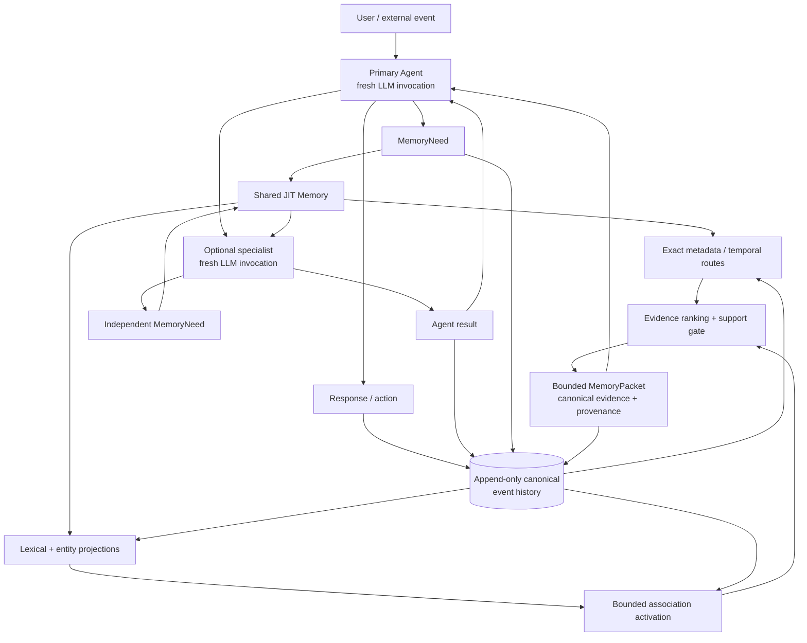
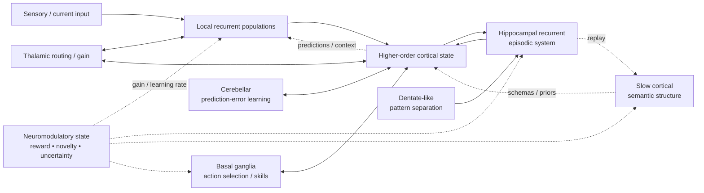
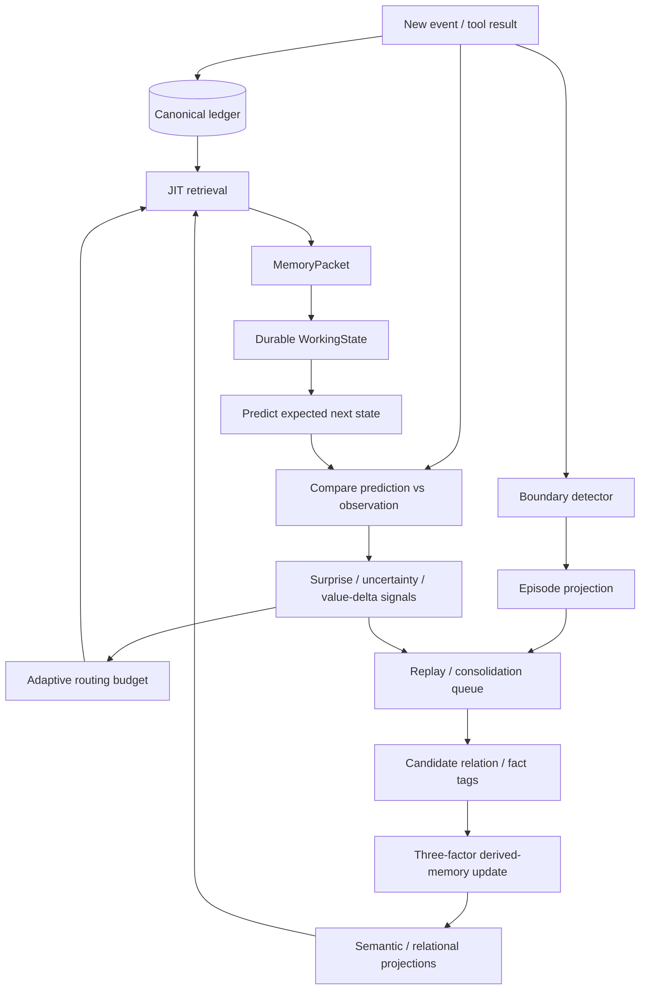
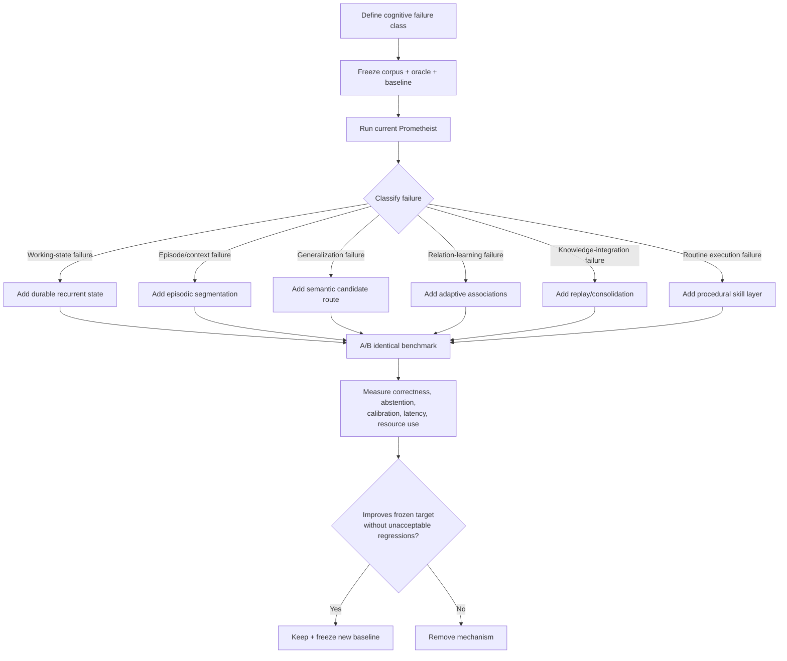

# Prometheist Architecture Through the Lens of Contemporary Cognitive and Computational Neuroscience

## Executive summary

The current Prometheist design available in the internal repository is not actually “unspecified” in practice: the available architecture documents describe an accepted **v0.6-era architecture**, with v0.7 durable execution identified as the next architectural milestone. Its defining invariant is that every LLM invocation is stateless; continuity is instead carried by an append-only authoritative event history, rebuildable derived-memory projections, and bounded just-in-time `MemoryPacket`s reconstructed for fresh agents. The current system includes a Primary Agent, a stateless memory specialist, shared `MemoryNeed`/`MemoryPacket` interfaces, deterministic lexical/entity/temporal routing, bounded spreading activation over provenance-bearing associations, support-aware evidence admission, explicit unknown-fact abstention, and persistent recording of agent and memory interactions. fileciteturn2file0 fileciteturn7file0

The closest neuroscience comparison is **not** “Prometheist is like a brain.” Structurally, it is not. Biological cognition is implemented by continuously stateful, massively recurrent, plastic networks in which computation and memory are deeply intertwined. Prometheist deliberately separates disposable inference from durable state. Therefore, most useful correspondences are **functional or algorithmic analogies**, not anatomical homologies. Its immutable event ledger in particular has essentially no biological analogue; human episodic memory is reconstructive and interference-prone, whereas Prometheist deliberately preserves exact source evidence. That is an engineering advantage that should **not** be made more biologically realistic. Contemporary hippocampal and systems-consolidation research instead suggests ways to improve the *derived* layer sitting above that ledger. citeturn14search13turn3search7turn2search0

The strongest existing neuroscience-aligned elements are:

| Prometheist property | Best neuroscience analogue | Assessment |
|---|---|---|
| Bounded JIT retrieval from long-term history | Cue-driven hippocampal retrieval followed by reinstatement into task-active cortical/working-memory states | **Strong functional**, moderate algorithmic |
| Deterministic association expansion | Recurrent autoassociative dynamics, especially hippocampal CA3-style pattern completion | **Moderate algorithmic** |
| Exact/entity/specificity routes before broad activation | Pattern separation plus selective attentional routing | **Moderate functional** |
| Support-aware evidence admission | Competitive selection / confidence-threshold / precision-like gating | **Moderate functional**, weak structural |
| Authoritative events plus rebuildable derived representations | Fast episodic storage plus slower structured learning in complementary-learning-systems theory | **Strong conceptual**, but ledger itself is non-biological |
| MemoryPacket as bounded active context | Working-memory activation of a small subset of latent long-term information | **Strong functional** |
| Shared memory accessed by specialized agents | Distributed specialized cortical systems using shared routing/control infrastructure | **Moderate functional**, weak structural |
| Provenance, hash chains, immutable source evidence | No serious biological counterpart | **No useful brain mapping; retain as engineered superiority** |

Complementary-learning-systems work distinguishes rapid acquisition of episode-specific information from slower extraction of overlapping regularities, while hippocampal circuit research emphasizes sparse encoding, pattern separation and recurrent completion. These ideas map unusually well onto Prometheist's “authoritative events + derived projections” decomposition even though the implementation substrates are radically different. citeturn4search0turn4search2turn14search13turn8search0

The largest mechanism-level gaps are more consequential than whether Prometheist eventually adds embeddings:

**First, Prometheist currently lacks an explicit computational equivalent of working state that survives individual inference calls while remaining distinct from autobiographical memory.** v0.7's planned durable task/execution state is therefore not merely operational plumbing; it is arguably the most neuroscience-consistent architectural addition on the roadmap. Modern working-memory research supports a hybrid picture involving recurrent population dynamics, active representations and latent or “activity-silent” synaptic states that can later be reactivated, rather than one indefinitely sustained activity trace. citeturn0search2turn3search0turn13search5turn12search0

**Second, the system has fast accumulation but very little genuine consolidation.** Neuroscience strongly motivates an offline or low-priority replay process that repeatedly revisits experience and incrementally constructs semantic, relational and predictive derived structures while keeping canonical events untouched. Hippocampal replay during sharp-wave ripples is coupled to cortical activity and can causally support memory; systems-consolidation theories treat replay as one mechanism by which recent memories become integrated with long-term cortical knowledge, although the exact fate of hippocampal dependence remains theoretically disputed. citeturn2search11turn14search4turn2search0turn2search1

**Third, Prometheist has associations but not a general plasticity regime.** Its current deterministic association rules are deliberately hand-engineered and versioned. A neuroscience-derived successor should preserve deterministic provenance while introducing a derived, reversible **three-factor plasticity system**: local coactivation or association evidence; an eligibility/tag trace; and a global or contextual reinforcement/salience/error signal. Synaptic-tagging-and-capture work and modern neuromodulatory learning models provide a strong mechanistic rationale for separating “this relation was recently eligible for strengthening” from “this event was sufficiently important/corroborated to stabilize the relation.” citeturn9search0turn9search1turn10search5turn20search0

**Fourth, Prometheist does not yet segment continuous history into episodes.** This matters because retrieval from lifetime history is not only a similarity problem; it is also a *structure-discovery problem*. Human neuroimaging and animal recordings indicate that experience is represented in event-like units, that high-level event boundaries engage the hippocampus, and that event structure supports later access to continuous memories. Automatic episode formation therefore deserves to precede indiscriminate semantic-vector infrastructure. citeturn15search1turn14search2turn14search9

**Fifth, the architecture lacks a general prediction-error layer.** Predictive coding is not established as the single canonical theory of cortex, and it would be a mistake to rewrite Prometheist around a fashionable free-energy vocabulary. But the empirical case for top-down predictions, recurrent feedback and circuit-specific sensory prediction-error amplification is substantial. Prometheist could use prediction errors much more conservatively—as signals for attention, retrieval expansion, belief revision, exploration and consolidation priority. citeturn1search0turn1search3turn18search1turn18search10

**Sixth, literal brain oscillations are low-priority inspiration.** Gamma/beta/theta organization provides evidence for multiplexed, direction-sensitive and burst-like communication, but copying biological frequencies into software would mostly reproduce a consequence of biological communication constraints rather than the underlying computational principle. Prometheist should emulate **timescale separation, burst scheduling, bandwidth allocation and feedforward/feedback multiplexing**, not 40-Hz loops. Recent work also cautions against treating every oscillatory code literally—for example, theta phase in human sequence working memory did not simply encode temporal order as often hypothesized. citeturn13search2turn13search5turn1search3turn17search13

The recommended priority sequence is therefore:

1. **Implement v0.7 as a distinct durable working-state system plus bounded recurrent inference**, not merely a resumable job queue.
2. **Add episodic segmentation and replay/consolidation**, producing slow, versioned semantic/relational projections from immutable history.
3. **Introduce tagged, salience-gated adaptive association plasticity**, with homeostatic limits, provenance and complete rebuildability.
4. **Add uncertainty/surprise/prediction-error signals that modulate retrieval depth, replay priority and evidence thresholds.**
5. **Stress deterministic memory on v0.8-like zero-overlap and distributed-evidence tests, then add a sparse learned semantic candidate generator only if those tests justify it.**
6. **Create a separate procedural/skill subsystem** for repeatedly successful workflows instead of forcing every learned behavior through episodic recall and LLM deliberation.
7. Treat biologically literal oscillations, neuron-level simulation and detailed neurotransmitter mimicry as **low-value complexity unless a frozen benchmark demonstrates a need**.

This ordering is unusually compatible with Prometheist's own experimental rule—freeze a measurable baseline, introduce one mechanism, rerun the same experiment, and keep the mechanism only when it earns its cost. fileciteturn4file0

## Current Prometheist architecture

The architectural baseline used for this comparison is the current design reflected by the repository's post-v0.6 documents rather than an invented hypothetical Prometheist version. v0.6 was closed on August 21, 2026; the architecture roadmap identifies v0.7 durable/restartable execution as the next milestone. fileciteturn4file0 fileciteturn7file0

The central decomposition is:



This representation captures several design choices explicitly described in the internal specification: the LLM is disposable computation; canonical persistent history is authoritative; derived memory is rebuildable; agents retrieve bounded context through a stable memory interface; meaningful system activity is automatically persisted; and derived associations remain routing aids rather than evidence in their own right. fileciteturn2file0 fileciteturn3file0

The v0.5 memory kernel provides the current empirically frozen retrieval baseline. Its PostgreSQL path uses independent bounded routes for exact-entity, lexical specificity/coverage and recency, followed by bounded association expansion and evidence admission. On the controlled 50,000-event-per-persona benchmark it returned 328/328 successful answers across three synthetic personas at a fixed candidate limit of 500, with evidence recall, mean reciprocal rank and unknown-fact abstention all reported as 1.000. Critically, the project documentation itself correctly warns that these are synthetic controlled results and do **not** establish general semantic-memory correctness. fileciteturn9file0

That distinction matters. Prometheist's current benchmark has established that broad semantic machinery is not needed for the tested problems. It has not established that lexical/entity/deterministic-association retrieval will survive the much harder regimes already listed for v0.8: zero-keyword-overlap paraphrases, changing aliases, multi-event inference, conflicting reports, corrections, long causal chains, heterogeneous artifacts, dense association graphs and automatic episode grouping. fileciteturn4file0

A useful neuroscience-oriented component catalog is therefore:

| Component | Current functional role | Current status | Most important architectural property |
|---|---|---|---|
| Stateless LLM invocation | Semantic interpretation, reasoning, generation | Implemented | No invocation owns durable continuity |
| Primary Agent | Top-level coordination and user-facing decision | Implemented | Orchestrates rather than owns memory |
| `memory_specialist` | Specialized memory-dependent reasoning | Implemented | Independently retrieves its own context |
| Canonical event ledger | Authoritative autobiographical/system history | Implemented | Append-only by application semantics |
| Hash/provenance metadata | Auditability and mutation detection | Implemented in principle/current kernel | Evidence traceability |
| Lexical/entity projections | Fast candidate routing | Implemented | Derived, disposable, rebuildable |
| Association projection | Relational candidate activation | Implemented | Bounded hops; provenance-bearing; cue-gated |
| Support-aware evidence gate | Reject topical-but-non-evidential matches | Implemented | Activation ≠ evidence |
| JIT Memory interface | Shared memory access boundary | Implemented | Retrieval strategy hidden from agents |
| `MemoryPacket` | Bounded active evidence context | Implemented | History size decoupled from context size |
| Projection-freshness bridge | Makes newly appended events retrievable | Implemented | Currently potentially O(N) per request |
| Durable execution/work state | Survive interrupted multi-step work | Planned v0.7 | Persistent intentions/task state |
| Episodic grouping | Group continuous history into episodes | Deferred | No mature automatic segmentation yet |
| Semantic/vector retrieval | Zero-overlap semantic candidate generation | Deferred | Must earn complexity in v0.8 |
| Probabilistic consolidation | Slowly learned derived memory | Deferred | No general consolidation process yet |
| Procedural memory | Compiled repeated workflows/skills | Unspecified | No explicit analogue currently documented |

The post-v0.6 audit also exposes an important mechanism-level issue: projection freshness currently loads visible canonical events and projected IDs on every memory request, making even an already-current freshness check O(N) in visible history; if projections are stale, deterministic association derivation may traverse visible history again. The audit sensibly proposes measurement before optimization and identifies a persisted high-water mark plus tail-only derivation as the likely solution. fileciteturn11file0

From a neuroscience perspective, this is one of the clearest cases where biology suggests not a metaphor but a practical optimization: biological learning is overwhelmingly **local and incremental**. Brains do not rescan a lifetime of synaptic history whenever one experience occurs. The system should likewise update derived state from the newly appended tail whenever possible.

## Neuroscience reference model

No single modern theory covers perception, attention, memory, learning and executive control. The best comparison is therefore a **mechanistic synthesis**, with confidence varying by mechanism.

**Perception is recurrent and hierarchical, not simply feedforward.** Rao and Ballard's seminal predictive-coding model proposed that higher levels convey predictions and lower levels propagate residual error. Subsequent primate and human electrophysiology found distinct frequency-direction relationships consistent with feedforward and feedback signaling—gamma/theta-biased feedforward influences versus alpha/beta-biased feedback—and causal/physiological evidence shows that recurrence becomes particularly important for difficult object-recognition cases. Modern experiments also demonstrate that corticocortical feedback recruits active dendritic mechanisms and can create contextual receptive fields outside classical feedforward receptive fields. citeturn1search0turn1search3turn1search4turn0search1turn18search10

Predictive processing has also become more circuit-specific. A 2024 study identified a higher-order thalamic plus VIP–SOM disinhibitory circuit that selectively amplifies *unexpected sensory content* in mouse V1 rather than merely broadcasting undifferentiated surprise. At the same time, contemporary theoretical work explicitly cautions that “Bayesian brain” and predictive-coding formulations can mean substantially different things, so prediction-error language should not be treated as a settled microscopic description of all cortical computation. citeturn18search1turn18search6turn18search0

**Attention is distributed control over routing and gain, not a single executive spotlight.** Thalamocortical experiments show that mediodorsal thalamus can amplify task-relevant prefrontal connectivity and sustain rule-specific cortical dynamics. Broader work on thalamic cognition interprets higher-order thalamus as participating in distributed cortical control rather than acting as a passive sensory relay. Prefrontal manipulations also alter feature-selective processing in sensory cortex. citeturn0search0turn0search5turn11search5

This is particularly important for Prometheist: the best brain analogue for a “router” is not a database search engine but **task-conditioned gain control over which pathways dominate computation**. A neuroscience-inspired routing layer should therefore decide not only *which memories match* but *which computational pathway deserves limited bandwidth now*.

**Working memory is heterogeneous and dynamic.** The classical persistent-firing view remains relevant in some circuits, but modern evidence does not support reducing working memory to tonic activity alone. Mongillo and colleagues showed computationally how short-term synaptic facilitation could maintain latent information efficiently. Perturbation experiments in humans can reveal item-specific “activity-silent” states during delay periods. Monkey PFC recordings find brief gamma and beta bursts associated with encoding, reactivation and control, while distributed frontoparietal areas can retain unattended information that sensory cortex no longer actively represents. citeturn3search0turn0search2turn13search5turn13search1turn11search10

Recurrent population dynamics provide a complementary account. In macaque PFC, context-dependent selection and evidence integration can be understood as trajectories of a recurrent population rather than isolated symbolic modules; recurrent neural networks reproduce important features of those dynamics. Motor cortical work similarly shows that population trajectories, not just static representations at individual neurons, can constitute computation. citeturn12search0turn12search1turn18search14

For Prometheist, the implication is strong: **a MemoryPacket is closer to the contents of working memory than the entire working-memory mechanism**. Working cognition also needs a stateful dynamical substrate that carries task variables, unresolved hypotheses, partial computations, decisions and action preparation over time. v0.7 is the natural place to build it.

**Episodic memory relies on sparse, context-sensitive hippocampal circuitry.** Dentate gyrus is strongly implicated in discrimination among overlapping memories; CA3 contains recurrent circuitry long associated with autoassociation and pattern completion. Contemporary recordings show context-dependent remapping and organized integration of new memories into hippocampal population state spaces. citeturn14search13turn8search0turn14search0turn14search3

Engram research adds an important caution: memories are associated with distributed neural ensembles whose accessibility and state can change over time; they are not immutable symbolic records. In mouse fear-learning paradigms, prefrontal and hippocampal engram populations change their relative accessibility during systems consolidation. That strengthens the functional analogy between Prometheist's derived indices and biological memory traces—but weakens any claim that its canonical SQL event rows resemble hippocampal episodes. citeturn3search5turn3search7

**Continuous experience is segmented into events.** Human naturalistic-neuroimaging work finds nested event representations over different timescales, with high-level event boundaries associated with increased hippocampal activity and later reinstatement. Mouse hippocampal recordings likewise identify representations of repeated “event” units beyond spatial location alone. These findings make episodic segmentation directly relevant to lifetime AI memory. citeturn15search1turn14search2

**Memory consolidation is an interaction between rapid storage, replay and slow integration.** Complementary-learning-systems theory argues that rapid hippocampal learning protects detailed experiences while slower cortical learning extracts shared structure without catastrophic interference. Sleep research provides substantial evidence for coordinated hippocampal replay and cortical processing, including hippocampal–cortical information exchange around sharp-wave ripples. But the field does not agree that old episodic memories simply migrate out of the hippocampus; contextual-binding and multiple-trace-like accounts retain a long-term role for hippocampal contextual representation. citeturn4search2turn4search0turn2search0turn2search11turn2search1

That disagreement actually favors Prometheist's architecture. It should **not** destructively replace original episodes with summaries. The neuroscience-inspired move is to build increasingly useful semantic/schema structures *alongside* exact source evidence.

**Procedural memory is partly separable from episodic/declarative memory.** Sensorimotor striatum is causally involved in detailed learned motor patterns and habitual skill execution; cerebellar circuits use sensory and prediction-error signals to tune learned responses. Different circuit families therefore specialize in selecting/compiling actions versus recalling declarative episodes. citeturn19search0turn19search7turn19search13turn19search1

Prometheist currently has no equally explicit architectural distinction between “I remember that workflow worked” and “I possess a compiled skill for executing that workflow.” This will eventually become a bottleneck: repeated successful behavior should migrate from repeated LLM deliberation into a parameterized, validated procedural representation.

**Plasticity is gated, multiscale and context dependent.** Synaptic tagging and capture showed that weakly modified synapses can become long-lasting when a transient local tag coincides with plasticity-related resources generated by sufficiently strong events. Modern computational neuroscience generalizes this family of ideas into eligibility traces and three-factor learning rules, while burst-dependent plasticity models show how top-down or contextual signals might solve aspects of credit assignment in hierarchical networks. citeturn9search0turn9search1turn20search0

Plasticity is also structural: learning can alter spine stability and circuit structure, REM sleep can selectively stabilize or prune learning-associated synapses in motor cortex, and experience-dependent myelination changes effective circuit properties over slower timescales. These mechanisms reinforce a general principle of **multiple adaptation timescales**, not a recommendation to model dendritic spines literally. citeturn8search2turn7search5turn20search4

**Neuromodulation supplies context-dependent global variables.** Dopamine neurons provide causal reward-prediction-error signals for learning, with experiments showing expectation-dependent subtraction and temporally precise dopamine manipulation altering associative learning. Noradrenergic locus-coeruleus activity, meanwhile, produces spatially and temporally structured modulation across cortex and can alter network-wide state rather than encoding one particular content item. citeturn10search0turn10search5turn10search11turn11search7

A software architecture should not create fake “dopamine” and “norepinephrine” numbers merely to sound brain-inspired. The deeper principle is that **content representations and learning-control signals are distinct**. Prometheist currently represents content and evidence very carefully but has only rudimentary architecture-wide variables for novelty, surprise, outcome value, unresolved uncertainty and learning priority.

**Sparse coding and competitive representation remain important principles, but not universal laws.** Olshausen and Field's seminal work showed that sparse coding of natural images learns localized oriented filters resembling early visual receptive fields; macaque V1 recordings subsequently demonstrated increased sparseness and decorrelation under natural stimulation. These results support sparse selective activation as an efficiency and interference-reduction principle. citeturn6search0turn6search1

The 2025 MICrONS functional connectomics program adds a particularly relevant bleeding-edge result. Dense functional imaging and electron-microscopy reconstruction now jointly cover tens of thousands of neurons and hundreds of millions of synapses across mouse visual areas, and analysis finds preferential “like-to-like” connectivity based on functional response properties across layers and areas, including recurrent and feedback connections. Recurrent artificial networks trained on visual tasks independently developed related connectivity patterns, and disrupting the structured connections impaired performance more than matched random disruption. citeturn17search0turn17search1

This cuts against a simplistic modular-agent picture. Cortex is not a collection of isolated experts communicating through a single dispatcher; it is densely recurrent, but **selectively structured within that density**.

**Oscillations likely organize communication, but their exact computational semantics remain under active debate.** Feedforward/feedback frequency asymmetries and communication-through-coherence theories are supported by substantial electrophysiology, and working-memory information can occur in temporally sparse gamma/beta bursts. Yet a 2025 human intracranial study found that theta firing phase did not straightforwardly reproduce memorized sequence order, illustrating why software should copy the computational abstraction—selective temporal coordination—not biological carrier frequencies. citeturn1search3turn13search2turn13search5turn17search13

**Structural connectivity is dense, weighted, directional and hierarchical.** Macaque tracer studies found an extremely dense interareal network with connection strengths spread across orders of magnitude; mouse connectomics demonstrates complex corticocortical and corticothalamic hierarchies whose patterns depend on cell class, cortical layer and projection direction. citeturn16search6turn16search0turn16search1

Taken together, the modern neuroscience picture is therefore not “many isolated modules plus memory.” It is closer to:



The relevant design principles are recurrent computation, sparse activation, controlled routing, fast/slow learning systems, replay, context-sensitive plasticity, prediction error, and specialized procedural circuits—not literal simulation of biological tissue.

## Architecture-to-brain mapping

The following scoring uses **structural correspondence** for similar organization/topology, **functional correspondence** for similar purpose, and **algorithmic correspondence** for similar computation. “Evidence” grades the neuroscience mechanism itself, not the claim that Prometheist is biologically equivalent.

| Prometheist component | Candidate brain mechanism | Structural | Functional | Algorithmic | Neuroscience evidence | Main mismatch |
|---|---|---:|---:|---:|---:|---|
| Stateless LLM worker | Transient cortical population computation | Low | Moderate | Low | High for dynamic population computation | Biological neurons and synapses remain continuously stateful; a fresh model invocation has no close analogue |
| Primary Agent | Distributed prefrontal–parietal–thalamic control | Low | Moderate–High | Moderate | High | Brain has no single top-level homunculus; control is distributed and recurrent |
| Canonical event ledger | Episodic memory substrate | **None/Low** | Moderate | Low | High that hippocampus supports episodic memory | Brain memory is reconstructive, mutable and distributed; SQL-style immutable source history is an engineered feature |
| Derived projections | Cortical semantic/schema representations | Low | High | Moderate | High under complementary-learning-system framework | Cortex does not maintain cleanly rebuildable indices with exact provenance |
| Lexical/entity sparse routing | Pattern separation + sparse cue activation | Low | Moderate–High | Moderate | Moderate–High | Symbolic tokens/entities are not biological representational primitives |
| Association graph | CA3-like recurrence / distributed semantic association | Low | High | Moderate–High | High for recurrent hippocampal circuitry | Fixed typed edges and two-hop deterministic decay are much simpler than plastic attractor dynamics |
| Cue-gated associations | Context-dependent retrieval and recurrent gating | Low | High | Moderate | High | Biological context emerges from population state; current Prometheist gates often depend on explicit cue terms |
| JIT Memory | Cue-dependent episodic retrieval/reinstatement | Moderate conceptually | **High** | Moderate–High | High | Biological recall reconstructs rather than fetches exact source rows |
| MemoryPacket | Activated working-memory representation | Low | **High** | Moderate | High | Packet is static text/records; biological working memory is a dynamical state that can transform during computation |
| Support-aware evidence admission | Precision/confidence/competitive gating | Low | High | Moderate | Moderate | No single neural “support gate”; confidence emerges from multiple circuits |
| Unknown-fact abstention | Metacognitive uncertainty / decision thresholding | Low | High | Moderate | Moderate | Human brains frequently confabulate; machine abstention can be more explicit and reliable |
| Memory specialist | Functionally specialized cortical circuit | Low | Moderate–High | Low | High for cortical specialization | Specialist is independently invoked rather than continuously coupled to peer circuitry |
| Shared MemoryNeed interface | Top-down goal cue / attentional bias | Low | High | Moderate | High | Biological request signals are distributed, not structured Pydantic messages |
| Persisted delegation/results | Interareal causal communication plus long-term trace | Low | Moderate | Low | High that distributed networks exchange task signals | Biological communication normally does not become an immutable autobiographical audit row |
| External/internal knowledge distinction | Exteroception versus stored memory | Moderate conceptually | High | Moderate | High | Biological perception and memory strongly interact instead of obeying a clean API boundary |
| Projection freshness | Online synaptic/circuit updating | Low | High | Currently low | High for incremental plasticity | Current O(N) freshness scans are almost the opposite of local incremental plasticity |
| Hash-chain integrity/provenance | None | None | None biologically | None | N/A | **Do not biologize this; it is a machine advantage** |
| Planned durable execution | Persistent task-set / prospective/working memory | Low–Moderate | **High** | Potentially High | High | Needs dynamics, prioritization and interference management, not just serialized job status |
| Future episodic grouping | Event segmentation and hierarchical episode models | Moderate conceptually | **High** | Potentially High | Moderate–High | No implementation yet |
| Future user-model/semantic structures | Distributed cortical schemas | Low | High | Moderate | High conceptually | Must avoid converting inferred beliefs into unqualified source truth |

Several mappings deserve more detailed treatment.

The **authoritative ledger ↔ hippocampus** analogy is tempting but should be resisted. Complementary-learning-systems theory makes the *overall two-layer decomposition* compelling—rapid episodic acquisition plus slower structured learning—but a PostgreSQL ledger is much closer to an engineered forensic archive than a hippocampus. The correct design conclusion is therefore: **keep the ledger non-biological; make the projection layer more biologically sophisticated.** fileciteturn2file0 citeturn4search0turn14search13

The **association graph ↔ CA3** mapping is substantially stronger algorithmically. CA3's recurrent architecture has long motivated autoassociative pattern completion, while dentate circuitry contributes to separating similar inputs. Prometheist's bounded spreading activation reproduces the broad computation “partial cue → recurrent expansion → candidate reconstruction” surprisingly well. But its hand-designed edge types, exact weights and cue-term gates mean it currently approximates a small symbolic associative network, not a self-organizing recurrent memory system. fileciteturn3file0 citeturn8search0turn14search13

The **MemoryPacket ↔ working memory** analogy is probably Prometheist's strongest existing functional alignment. Brain systems similarly avoid simultaneously activating every stored experience. But a packet is the *contents* of a workspace, not the workspace's dynamics. Working-memory studies demonstrate reactivation, latent states, recurrent trajectories and task-dependent selection; Prometheist needs an explicit mutable task-state layer to obtain that second half. fileciteturn7file0 citeturn0search2turn13search1turn12search0

The **Primary Agent ↔ prefrontal cortex** analogy is useful only after removing the “CEO of the brain” interpretation. PFC participates in distributed recurrent control, while thalamic and basal-ganglia loops regulate which representations and actions dominate. A neuroscience-informed Prometheist should therefore gradually reduce the Primary Agent's role as an omniscient central decision-maker and increase its role as a **task-state coordinator operating through explicit specialized loops**. That does not require a swarm of peer agents; a shared durable workspace is a simpler and more defensible implementation. citeturn0search0turn12search0turn19search5

The **stateless-invocation principle is simultaneously Prometheist's most un-brain-like and most defensible design decision.** Biological cognition has enormous amounts of hidden continuity in membrane potentials, synaptic efficacies, neuromodulator concentrations, network trajectories and structural changes. Prometheist intentionally destroys inference activation state between calls. That divergence is acceptable because the invariant provides auditability, replaceability and restart safety. The neuroscience-compatible move is not to abandon it; it is to externalize the biologically relevant *state variables* explicitly so that fresh inference can reconstruct them.

## Neuroscience-derived modifications

The modifications below deliberately preserve Prometheist's strongest engineering invariants: canonical history stays immutable, LLM calls may remain stateless, derived memory stays disposable/versioned, provenance remains mandatory, and new mechanisms must beat frozen baselines.

| Priority | Proposed mechanism | Neuroscience basis | Expected benefit | Complexity | Principal risk | Resources |
|---|---|---|---|---|---|---|
| **Critical** | Durable working-state + bounded recurrent inference | Recurrent PFC dynamics; activity-silent WM | Multi-step reasoning, interruption recovery, distributed-fact integration | Medium | Runaway loops/stale state | Mostly DB/schema + ordinary LLM calls |
| **High** | Hierarchical episodic segmentation | Event-boundary coding | Better temporal/context retrieval; fewer false associations | Medium | Incorrect boundaries | CPU; optional small embedding/model |
| **High** | Offline/idle replay and slow consolidation | Hippocampal replay; CLS | Semantic generalization without destroying episodes | Medium–High | Consolidating errors | Storage + scheduled CPU/LLM budget |
| **High** | Tagged three-factor association plasticity | Synaptic tagging; neuromodulation | Learn relations from use/outcomes instead of hand rules | Medium–High | Self-reinforcing false edges | Lightweight DB projections |
| **High** | Surprise/uncertainty/value modulation | Dopamine/NE/prediction error | Better allocation of memory/reasoning resources | Medium | Bad salience proxy | Low compute |
| **Medium** | Predictive state/error layer | Hierarchical predictive processing | Proactive anomaly detection, correction, exploration | High | Confirmation bias from bad priors | Model calls + state model |
| **Conditional** | Sparse learned semantic candidate route | Sparse distributed coding | Zero-overlap paraphrase retrieval | Medium | Semantic false positives | Embedding model/index if earned |
| **Medium** | Procedural skill memory | Basal ganglia/cerebellar learning | Cheap reliable execution of repeated workflows | High | Automating stale/unsafe behavior | Workflow executor + validation |
| **Medium** | Homeostatic graph normalization/pruning | Competitive/structural plasticity | Stops association hubs and graph blow-up | Low–Medium | Pruning rare useful relations | Minimal |
| **Low** | Oscillatory/time-phase emulation | Neural synchronization | Possible scheduling/multiplexing | Low if abstract, very high if literal | Cargo-cult neuroscience | Do **not** implement literal oscillators |

**Durable working-state should be upgraded from “restartable orchestration” to a cognitive primitive.** v0.7 should maintain a typed, mutable, externally persisted `WorkingState` separate from both `MemoryPacket` and canonical autobiographical events. It should contain the current goal, subgoals, active hypotheses, evidence commitments, unresolved questions, selected entities, action candidates, dependency graph, uncertainty estimates, prior step outputs and explicit termination criteria. The state itself can be checkpointed as events for auditability, but its projection should behave as mutable working state. This is closely aligned with recurrent and activity-silent accounts in which task-relevant information persists through changing representational states rather than requiring every detail to remain continuously active. fileciteturn4file0 citeturn0search2turn12search0turn17search14

A bounded recurrent agent cycle would then become:

```text
WorkingState
    ↓
fresh inference
    ↓
identify uncertainty / missing evidence
    ↓
targeted MemoryNeed or tool action
    ↓
evidence/result
    ↓
update WorkingState
    ↓
fresh inference
    ↓
converged? ──no──> repeat, under hard budget
       │
      yes
       ↓
response/action
```

This keeps every LLM call stateless while making the **system-level computation recurrent**, which is much closer to the way biological cognition accumulates and transforms information across time. Recurrent processing is particularly important when difficult perceptual or cognitive cases cannot be solved by a single feedforward pass. citeturn0search1turn12search0

Hard safeguards should include a maximum recurrence depth, a total token/time budget, explicit state-delta logging, uncertainty monotonicity tests where appropriate, duplicate-query detection and a “no new information” termination condition. Otherwise recurrent cognition easily becomes expensive self-conversation rather than useful iterative computation.

**Add hierarchical event segmentation before a general-purpose vector database.** On ingestion, every canonical event should remain atomic, but a separate `EpisodeProjection` should identify nested groupings such as interaction, task, session, project episode and longer narrative chapter. Boundaries can initially use deterministic features—time gaps, conversation switches, task IDs, participant changes, file/tool transitions and explicit lifecycle events—before testing learned change-point models. Human naturalistic cognition exhibits hierarchical event boundaries across distinct timescales, and hippocampal activity at high-level boundaries predicts later reinstatement. citeturn15search1

A possible schema is:

```text
EpisodeProjection
  episode_id
  level                 # interaction / local episode / project episode / chapter
  start_global_seq
  end_global_seq
  boundary_features
  participating_entities
  dominant_task_ids
  parent_episode_id
  source_event_ids
  derivation_version
  boundary_confidence
```

The payoff is not merely summarization. Episodes become routing units: “what happened around the restaurant opening problem?” can retrieve a relevant episode before individual evidence rows, while exact evidence remains canonical. Event boundaries may also provide efficient memory-search access points rather than requiring linear traversal of continuous history. citeturn15search3

**Build slow replay/consolidation as a second learning pathway.** The ledger already provides the fast-learning side of a complementary system. Add a replay scheduler that samples old episodes under controlled policies and asks narrow extraction algorithms to update derived structures. Replay candidates should include recent episodes, unresolved episodes, high-surprise episodes, corrected beliefs, rarely accessed episodes, important weakly represented episodes and events implicated by retrieval failures. Hippocampal replay is not simply a frequency-of-use cache; work on consolidation suggests selective reactivation and integration of memory into broader knowledge structures. citeturn2search0turn14search4

Crucially, replay should never “compress away” canonical history. It should produce versioned artifacts such as:

```text
semantic_fact
relationship
entity_alias
episode_schema
causal_hypothesis
preference_state
procedural_candidate
prediction_model
retrieval_feature
```

Each must retain provenance, derivation version and confidence. This is a very close fit to Prometheist's existing distinction between authoritative and derived state. fileciteturn2file0

Replay should also deliberately include **anti-frequency sampling**. If only frequently retrieved events are replayed, the system creates a rich-get-richer memory ecology in which unusual but important episodes disappear from the effective model. Neuroscience does not imply simple frequency replay; sleep replay can preferentially support behaviorally relevant and recent experiences, and systems-level theories emphasize restructuring rather than simple copying. citeturn2search0turn2search2

**Turn association creation into tagged, three-factor plasticity.** Keep current deterministic relationships as the control condition. Introduce a separate experimental projection where candidate relationships acquire:

```text
eligibility
coactivation_count
prediction_support
retrieval_success_count
retrieval_failure_count
user_confirmation
contradiction_count
last_activated_at
decayed_strength
provenance_event_ids
derivation_version
```

A relation should first enter an **eligible** state based on local evidence such as co-occurrence, temporal adjacency, repeated retrieval coactivation or explicit structural extraction. It should become a strong long-lived association only when a second signal provides justification: successful downstream use, repeated independent evidence, user confirmation, prediction-error reduction or another predefined reinforcement criterion. This mirrors the computational distinction in synaptic tagging and three-factor learning between a local eligibility event and a later/global stabilizing signal. citeturn9search0turn9search1turn20search0

An illustrative—not neurobiologically literal—update could be:

\[
\Delta w_{ij}
=
\eta \; e_{ij}
\left(
\alpha R
+\beta S
+\gamma C
-\delta E
\right)
-\lambda w_{ij}
\]

where \(e_{ij}\) is a decaying eligibility trace, \(R\) is successful retrieval/use, \(S\) is corroborating surprise or informational value, \(C\) is explicit confirmation, \(E\) is contradiction/error, and \(\lambda\) imposes slow decay. The coefficients are engineering hyperparameters, not claimed neurotransmitter equivalents.

This should be coupled to **homeostatic normalization**: cap total outgoing association mass per node or relation class, penalize generic hubs and require increasing evidence for already-high-degree concepts. Modern connectomics indicates dense connectivity can coexist with highly non-uniform connection strength and functional specificity; unconstrained “everything connects to everything” is neither computationally desirable nor biologically accurate. citeturn16search6turn17search1

**Introduce architecture-wide modulatory variables without pretending they are neurotransmitters.** Suggested state variables are:

| Signal | Engineering meaning | Main effect |
|---|---|---|
| `novelty` | Distance from existing representations/history | Episode formation, exploration |
| `surprise` | Mismatch between predicted and observed outcome | Retrieval expansion, model update |
| `uncertainty` | Lack of decisive evidence | More deliberation/tool use |
| `value_delta` | Outcome better/worse than expected | Learning/replay priority |
| `correction` | User/system explicitly reverses prior belief | Aggressive supersession review |
| `urgency` | Time/cost pressure | Narrower retrieval and earlier decision |
| `confidence` | Evidence support for current state | Controls abstention/commitment |

Dopaminergic prediction-error experiments support using outcome discrepancies as teaching signals, while noradrenergic research supports a broader role for global state/gain changes. But Prometheist should maintain separate engineering semantics rather than one global “salience” scalar that conflates reward, surprise and uncertainty. citeturn10search0turn10search11turn11search7

A particularly useful interaction would be:

```text
high uncertainty + low surprise
    -> deeper evidence search

high surprise + high-confidence prediction
    -> create prediction-error event
    -> broaden retrieval
    -> prioritize episode for replay

high user correction
    -> preserve original event
    -> supersede current-state projection
    -> tag implicated derived relations for re-evaluation
```

This preserves Prometheist's historical-truth/current-state distinction while making derived memory more adaptive. fileciteturn2file0

**Add predictive processing conservatively.** A `PredictiveState` should represent explicit expected outcomes of ongoing tasks, not hallucinated “priors” about everything. Examples include: expected next workflow state, expected tool result class, expected completion time range, expected user preference based on established evidence, expected entity lifecycle state, or expected observation from a sensor. When evidence arrives, a deterministic layer computes discrepancies. Prediction errors then change routing or learning; they do not overwrite evidence.

This is closer to the empirical core of predictive processing—comparison of expected and observed states and selective amplification of mismatches—than implementing an all-encompassing free-energy objective. Contemporary visual-circuit work shows prediction errors can selectively amplify the unexpected sensory representation itself, and cortical feedback actively alters lower-level processing. citeturn18search1turn18search10

For example:



**Use learned semantic retrieval only as a candidate generator.** Neuroscience clearly supports distributed similarity-sensitive representations, sparse codes and feature-selective connectivity; it does *not* specifically endorse dense embeddings, cosine similarity or a vector database. citeturn6search0turn17search1

Prometheist's existing epistemic architecture provides an unusually clean way to use embeddings safely:

```text
semantic representation
       ↓
candidate hypothesis
       ↓
canonical event recovery
       ↓
support-aware evidence gate
       ↓
MemoryPacket
```

That is superior to:

```text
similar embedding
       ↓
treat text as answer
```

The learned route should therefore enter v0.8 only after freezing cases in which current mechanisms fail on zero-keyword overlap, entity aliases or concept generalization. It should compete against the exact same benchmark and retain only if it improves evidence recall without unacceptable precision, abstention, latency or calibration losses. That sequence is already consistent with the roadmap. fileciteturn4file0

A **sparse** learned representation is preferable for the first experiment: top-\(k\) activated semantic features, bounded candidates, or a small local embedding model followed by aggressive candidate truncation. Sparse coding has strong efficiency/interference-reduction motivations in sensory neuroscience, while Prometheist's commodity-hardware constraint makes bounded activation independently desirable. citeturn6search0turn6search1

**Create a distinct procedural-memory layer.** When the same validated task is solved repeatedly, Prometheist should be able to compile the solution into a structured skill:

```text
Skill
  trigger_conditions
  preconditions
  required_permissions
  typed_inputs
  action_graph
  expected_outputs
  validation_checks
  recovery_policy
  provenance
  execution_statistics
  version
```

This is much closer to the functional separation between episodic memory and basal-ganglia/cerebellar skill learning than having the Primary Agent repeatedly retrieve old episodes and reinvent the procedure in natural language. Sensorimotor basal-ganglia experiments demonstrate specialized representations of practiced kinematics, while cerebellar error signals adapt learned responses when predictions fail. citeturn19search0turn19search13turn19search1

For a personal AI, the analogue is not motor kinematics but **compiled action policy**: preparing a recurring report, carrying out a known file transformation, executing a permission-bounded maintenance workflow, or applying a stable user preference. Such policies should remain interruptible and auditable, and a prediction error should kick execution back up to deliberative reasoning rather than blindly continuing a habitual routine.

**Do not implement literal neural oscillations.** The useful translation is to split computation into timescales:

```text
fast:       current inference / perception / action
medium:     working-state recurrence and memory retrieval
slow:       consolidation / association plasticity
very slow:  schema, policy and user-model revision
```

Likewise, separate “bottom-up evidence ingress” from “top-down prediction/context” channels rather than trying to schedule them at gamma and beta frequencies. Feedforward/feedback frequency asymmetries and burst dynamics demonstrate that temporally segregated communication matters in biology, but frequencies themselves solve membrane/synapse coordination problems that ordinary software does not possess. citeturn1search3turn13search2turn13search5

## Experimental program and evaluation metrics

Prometheist's existing experimental philosophy is unusually well suited to neuroscience-inspired work. Each proposal should begin with a **frozen failure**, not with a new subsystem. The correct experimental workflow is:



This is directly consistent with the project's internal rule that new architectural complexity must earn itself experimentally. fileciteturn4file0

A rigorous benchmark program should expand beyond the current successful synthetic exact-recall regime.

| Experimental family | Frozen challenge | Primary metrics | Neuroscience-inspired hypothesis |
|---|---|---|---|
| **Working-state recurrence** | Multi-step task interrupted between stages | Resume success, state reconstruction accuracy, task success, loops, tokens | Explicit latent/durable task state beats reconstructing all state from autobiography |
| **Distributed evidence** | Answer requires 2–6 events that individually do not answer query | Joint evidence recall, answer accuracy, unnecessary evidence | Iterative retrieval-reasoning loops outperform one-shot packet |
| **Episode segmentation** | Dense timeline with unrelated adjacent events and recurring entities | Episode-boundary F1, contextual precision, retrieval recall | Episode-level routing reduces temporal/context interference |
| **Semantic generalization** | Zero shared keywords and changing aliases | Recall@k, MRR, precision, abstention | Learned candidate generator improves recall when deterministic lexical routes fail |
| **Pattern separation** | Highly similar episodes differing in one critical attribute | False-memory rate, state confusion, precision | Contextual/episode features reduce interference |
| **Pattern completion** | Query provides partial cue only | Target recall, rank, distractor activation | Adaptive associative retrieval improves partial-cue access |
| **Consolidation** | Facts distributed across repeated episodes | Schema-question accuracy, source recovery, contradiction handling | Replay builds reusable semantic structure |
| **Correction/reconsolidation** | Repeated belief followed by authoritative correction | Current-state accuracy, historical accuracy, stale activation rate | Tagged re-evaluation updates derived state without destroying history |
| **Adaptive plasticity** | Relation appears repeatedly, disappears, then reverses | Edge precision/recall, adaptation lag, forgetting | Three-factor association policy tracks meaningful structure |
| **Prediction error** | Expected workflow/tool result violated | Detection rate, correction latency, false alarm rate | Explicit errors improve attention/replanning |
| **Procedural compilation** | Routine task repeated tens/hundreds of times | Success, LLM calls/task, latency, cost, variance | Compiled skills reduce deliberative compute without hurting correctness |
| **Long-history scale** | 50k→500k→multi-million events | p50/p95/p99, candidate bound, RAM, rebuild/update cost | Incremental locality maintains bounded online cost |

The system should preserve its existing retrieval metrics—evidence recall, mean reciprocal rank, unknown-fact abstention and p50/p95 latency—but these are no longer sufficient once memory becomes adaptive. fileciteturn9file0

Several additional metrics become necessary.

**Calibration:** when the system assigns confidence \(p\), measured correctness should match that confidence. Use Brier score, expected calibration error and selective-accuracy curves. A system that retrieves more but cannot recognize uncertainty is cognitively worse despite higher raw recall.

**Evidence precision:** current Prometheist correctly distinguishes activation from evidence admission. Preserve this. Measure precision@\(k\), unsupported-evidence rate and “topically related but non-supporting” admission rate.

**Historical/current-state dissociation:** every correction benchmark should score both “What was believed in March?” and “What should be believed now?” separately. The architecture already explicitly preserves that distinction. fileciteturn2file0

**Interference:** create near-duplicate episodes, same-named entities, repeated state transitions and adversarial semantic overlap. Pattern-separation quality should be measured as cross-episode contamination rather than mere retrieval failure.

**Derived-memory provenance:** every semantic fact, association or skill should have a recoverable path to supporting source events. Score source-recovery rate and provenance completeness.

**Consolidation fidelity:** measure whether a derived schema improves held-out questions while preserving the ability to recover exceptions. A consolidation mechanism that learns “Mike usually does X” but systematically hides instances where Mike did Y has over-generalized.

**Graph health:** adaptive associations require degree distributions, hubness, edge churn, stale-edge persistence, edge-strength entropy and proportion of edges actually useful in successful retrieval.

**Plasticity stability:** after learning new relations, rerun old benchmarks. Measure catastrophic interference rather than assuming newly improved accuracy is free.

**Working-memory efficiency:** record active-state size, context tokens per step, recurrent iterations and marginal accuracy gain from each additional retrieval cycle.

**Procedural automaticity:** compare deliberative and compiled execution on identical tasks. Measure not only success and latency but recovery from unexpected conditions. A skill subsystem is valuable only if unexpected inputs reliably cause escalation back to reasoning.

**Prediction quality:** use log loss or Brier score for explicitly probabilistic predictions and separate predictable failures from unforeseeable novelty. A prediction-error architecture can become self-fulfilling if it is evaluated only by whether it “noticed something.”

**Resource boundedness:** because Prometheist explicitly targets modest local hardware, every new mechanism should report CPU time, peak RAM, persistent-storage growth, derived-state update latency, LLM calls and context tokens. A 1% retrieval improvement requiring a dedicated GPU and 20× maintenance cost is probably a bad architectural trade under the project's stated goals. fileciteturn2file0

For projection freshness specifically, the internal audit already gives an excellent experimental matrix: current projections versus one appended event versus a burst of events; 1k, 10k and 50k+ histories; and lexical-only versus association-producing updates. Add a high-water-mark/tail-only implementation only after measuring that baseline, then compare both versions without modifying the retrieval kernel. fileciteturn11file0

For consolidation, an especially informative experiment would compare four conditions:

| Condition | Raw ledger | Deterministic projections | Replay | Adaptive relations |
|---|---:|---:|---:|---:|
| Control | ✓ | ✓ | — | — |
| Replay-only | ✓ | ✓ | ✓ | — |
| Plasticity-only | ✓ | ✓ | — | ✓ |
| Replay + plasticity | ✓ | ✓ | ✓ | ✓ |

The benchmark should include repeated regularities, rare exceptions, later corrections and held-out semantic questions. This separates the benefit of replay from the benefit of plastic relation extraction rather than prematurely bundling them.

Similarly, learned semantic retrieval should be tested as a **candidate-route ablation**, not as a wholesale new memory system:

\[
\Delta \mathrm{utility}
=
w_r\Delta\mathrm{Recall}
+
w_p\Delta\mathrm{Precision}
+
w_a\Delta\mathrm{Abstention}
-
w_l\Delta\mathrm{Latency}
-
w_m\Delta\mathrm{Memory}
-
w_c\Delta\mathrm{Complexity}.
\]

The coefficients should be declared before the experiment. Otherwise any new subsystem can be rationalized after the fact by whichever metric happens to improve.

## Risks, feasibility, and prioritized roadmap

The principal danger in neuroscience-inspired architecture work is **cargo-cult biologization**: copying surface features of nervous systems without the physical constraints that make those features useful.

Prometheist should not become a spiking-neural simulator. It should not create named “dopamine”, “hippocampus” and “thalamus” services merely because those labels sound cognitively sophisticated. Modern neuroscience is most valuable here as a source of **computational principles and falsifiable architectural hypotheses**.

The table below ranks the recommendations specifically for the current architecture and hardware philosophy.

| Recommendation | Benefit | Feasibility now | Engineering risk | Scientific confidence | Overall priority |
|---|---:|---:|---:|---:|---:|
| Durable typed WorkingState | Very high | High | Medium | High | **Immediate** |
| Bounded recurrent inference | Very high | High | Medium–High | High | **Immediate** |
| Tail-only incremental projection updates | High performance benefit | High | Low | High general principle | **Immediate after measurement** |
| Hierarchical episodic segmentation | High | High | Medium | Moderate–High | **High** |
| Replay/consolidation | Very high long-term | Medium–High | Medium–High | High principle; details debated | **High** |
| Tagged adaptive associations | High | Medium–High | Medium–High | High principle | **High** |
| Modulatory surprise/uncertainty signals | High | High | Medium | High principle | **High** |
| Prediction-error state model | Medium–High | Medium | High | Moderate | **Medium** |
| Sparse semantic candidate generation | Potentially high | High | Medium | High representation principle, indirect algorithm mapping | **Conditional on v0.8 failure** |
| Procedural skill memory | Very high at mature scale | Medium | High | High functional dissociation | **Medium after durable execution** |
| Lateral specialist coupling | Uncertain | Medium | High complexity | Moderate | **Low until measured need** |
| Literal oscillatory scheduling | Low | Technically easy | Conceptual/maintenance risk | Low transfer validity | **Do not prioritize** |
| Spiking-neuron/biophysical simulation | Negligible for present goals | Low on target hardware | Extreme | Irrelevant | **Reject** |

The **highest-return architectural move is v0.7**, but its specification should be widened. The current roadmap correctly asks whether unfinished intentions and task state can survive process destruction. fileciteturn4file0 The neuroscience comparison suggests making the answer a general `WorkingState` abstraction, not a narrowly operational `TaskRow`. Otherwise Prometheist will later need a second mechanism for active hypotheses, prospective intentions and multi-step evidence accumulation.

The second priority should be **event segmentation plus replay**, because together they create the substrate on which useful consolidation can occur. Segmentation identifies the unit of experience; replay decides which units deserve additional computation. This pairing provides far more cognitive leverage than immediately adding arbitrary vector similarity.

The third priority should be **adaptive derived memory under strict provenance**. Prometheist's architecture is unusually well positioned to experiment here because failed plasticity cannot destroy source history. An association projection can be deleted and rebuilt after a bad experiment. That dramatically lowers the epistemic risk of testing neuroscience-like plasticity.

The main failure mode is self-reinforcement. Suppose a mistaken derived relationship raises an event's retrieval probability, causing the event to be repeatedly retrieved, causing the relationship to receive additional coactivation credit. Without homeostatic and external-outcome terms, the graph can manufacture its own evidence. Three defenses are mandatory: canonical evidence must remain separate from activation, association reinforcement must distinguish *retrieval* from *successful downstream verification*, and high-degree/high-strength edges should face increasing stabilization thresholds.

Another risk is **consolidation-induced confabulation**. Biological memory is perfectly capable of integrating, generalizing and distorting. Prometheist's mission explicitly values machine-level historical fidelity, so biological consolidation should only operate in the rebuildable layer. A generated summary or inferred preference must never silently acquire the authority of a source event. fileciteturn2file0

Prediction systems introduce **confirmation bias**. If top-down expectations constrain retrieval too early, disconfirming evidence becomes less likely to enter the working set. Empirical predictive-processing circuits often amplify prediction errors, not merely predicted content, which suggests a useful safeguard: high-confidence priors should lower the threshold for processing contradictory observations rather than suppress them. citeturn18search1

Neuromodulatory analogues introduce **value-lock-in**. A learned “importance” signal based on user engagement or retrieval frequency can over-prioritize emotionally vivid, recent or repetitive content. Maintain separate novelty, uncertainty, explicit user value, correction and behavioral-outcome variables rather than collapsing all of them into one salience score.

Procedural compilation introduces **habit rigidity**. Basal-ganglia research itself shows that practiced behavior can become increasingly automatic. In an AI system, that efficiency becomes dangerous when permissions, external APIs or user preferences change. Every compiled skill therefore needs precondition validation, an explicit version, postcondition checks and a reliable path back to deliberative execution. citeturn19search7turn19search4

Semantic representations introduce **similarity-without-entailment**, the exact class of failure Prometheist's evidence gate was designed to prevent. Any learned semantic mechanism must remain upstream of canonical evidence admission. That architectural boundary should be treated as non-negotiable.

Dense multi-agent coupling introduces **complexity without demonstrated cognition**. The 2025 MICrONS results show that biological cortex contains rich recurrent and feedback connectivity with functional structure, but this does not mean Prometheist needs dozens of agents talking to one another. citeturn17search0turn17search1 A shared durable working state and explicit routed specialist calls can capture much of the useful computational principle while remaining understandable to one developer.

A realistic roadmap aligned to the present project would therefore be:

**Current v0.7:** durable `WorkingState`, explicit task lifecycle, restart tests, bounded recurrent Primary/specialist loops, incremental projection watermark benchmark and—if warranted—tail-only updates.

**Early memory-generalization work:** event segmentation, episode-aware retrieval and difficult interference/zero-overlap/multi-event benchmarks.

**Next consolidation experiment:** bounded replay producing versioned facts, aliases, relational candidates and schemas, with held-out generalization plus provenance tests.

**Next plasticity experiment:** candidate relation tags, eligibility decay, outcome/correction reinforcement and homeostatic graph limits.

**Only after frozen semantic failures:** one sparse semantic candidate route, benchmarked against exactly the same failures.

**After durable execution is reliable:** procedural skill extraction and safe compiled execution.

This sequence uses neuroscience to deepen mechanisms without sacrificing the architectural discipline that is already one of Prometheist's strongest features.

## Evidence hierarchy and prioritized sources

The scientific literature behind this report is not equally settled. The following hierarchy is useful when deciding how strongly architecture should respond.

**Highest-confidence principles** are recurrent cortical computation; hippocampal involvement in episodic/context memory; sparse/pattern-separated hippocampal coding; specialized basal-ganglia/cerebellar learning systems; distributed attention/control; prediction-error signals in specific circuits; plasticity conditioned on more than simple co-occurrence; and dense but structured anatomical connectivity. These conclusions are supported by combinations of electrophysiology, perturbation, anatomy and computational modeling. Representative primary work includes recurrent object recognition and PFC dynamics, thalamic attentional amplification, cerebellar and dopamine prediction errors, and modern connectomics. citeturn0search1turn12search0turn0search0turn10search0turn19search13turn17search0

**Strong but theoretically non-unique principles** include complementary learning systems, replay-driven consolidation, activity-silent working memory, communication through oscillatory coherence and hierarchical predictive coding. The empirical phenomena are real, but multiple computational explanations remain viable. Prometheist should extract architecture-level principles without committing to one neuroscience school as ground truth. citeturn4search0turn2search0turn0search2turn13search2turn18search6

**Particularly high-value seminal sources** include Rao and Ballard's predictive-coding model; McClelland, McNaughton and O'Reilly's complementary-learning-systems formulation; Olshausen and Field on sparse natural-image codes; Frey and Morris on synaptic tagging and capture; and Mongillo, Barak and Tsodyks on synaptic working memory. Their age does not make them outdated; they remain foundations for active modern research programs. citeturn1search0turn4search2turn6search0turn9search0turn3search0

**High-value recent sources** include the 2023 demonstration that corticocortical feedback engages active dendrites, the 2024 identification of a cooperative thalamocortical sensory-prediction-error circuit, modern hierarchical plasticity work, and recent evidence for structured recurrent computation. citeturn18search10turn18search1turn20search0turn18search8

The **bleeding edge of direct architectural relevance** is the 2025 MICrONS work. Its dataset jointly relates large-scale functional responses to electron-microscopy connectivity, and associated analyses identify cross-layer and cross-area function-dependent connection rules. These results make a strong case that future neuro-inspired AI architectures should focus less on named brain modules and more on how **structured connectivity, recurrence and selective interaction shape population computation**. citeturn17search0turn17search1turn17search7

Very recent work also illustrates why caution is necessary. A 2026 theoretical/computational study emphasizes low-dimensional population geometry for tasks sharing latent structure, while a 2025 human intracranial study challenged a simple interpretation of theta phase as temporal sequence code. The frontier is moving from “which region represents X?” toward understanding distributed geometry, dynamics and circuit constraints—and it routinely overturns overly literal coding stories. citeturn17search17turn17search13

For Prometheist specifically, the resulting scientific judgment is:

> **The architecture should become more brain-inspired primarily in its derived-memory dynamics, working-state recurrence, adaptive routing, consolidation, plasticity and procedural specialization—not in its canonical storage, auditability, determinism of system facts, or commitment to stateless replaceable LLM workers.**

Prometheist's most valuable biological analogue is therefore not a particular brain region. It is the emerging systems-neuroscience principle that intelligent behavior arises from **selective activation of sparse information, recurrent task-dependent computation, multiple interacting learning timescales, error-driven adaptation, structured connectivity and continual reconstruction of useful state from long-term traces**. citeturn12search0turn4search0turn20search0turn18search1turn17search1

Its most valuable *non-biological* features—immutable source evidence, exact provenance, explicit abstention, rebuildable interpretations and model replaceability—should remain deliberately non-biological. Human brains are not reliable audit logs. Prometheist should learn from their mechanisms without inheriting their epistemic weaknesses.