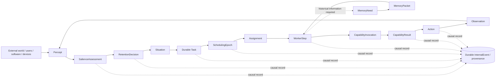
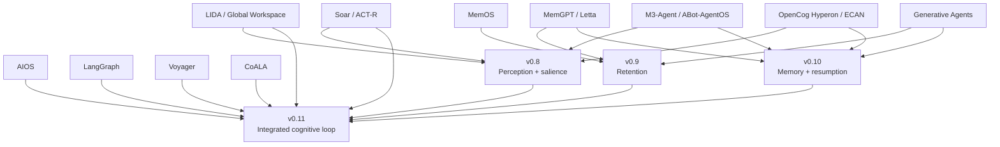

# Prometheist and Prior Work: A Rigorous Architecture Mapping

> **Point-in-time research synthesis.** Internal implementation descriptions below
> refer to the v0.7 state available when this comparison was written. The current
> v2 response path and post-v0.7 roadmap are governed by
> [`../architecture/PERCEPT_TO_RESPONSE_PIPELINE.md`](../architecture/PERCEPT_TO_RESPONSE_PIPELINE.md)
> and [`../ROADMAP.md`](../ROADMAP.md). The comparative lessons remain research input,
> not current implementation authority.

## Executive summary

Prometheist is **not unprecedented at the level of individual mechanisms**. Nearly every major functional idea in the current roadmap has a substantial antecedent: persistent external memory in MemGPT/Letta; central resource scheduling in AIOS; attention allocation and shared cognitive substrates in OpenCog/Hyperon; recurrent perception–decision–action loops in Soar, ACT-R, and LIDA; autobiographical observation/reflection/planning in Generative Agents; lifelong skill accumulation in Voyager; durable checkpointed execution in LangGraph; memory as an operating-system resource in MemOS; and continuous multimodal perception plus entity-centric long-term memory in M3-Agent and ABot-AgentOS. citeturn20view6turn21view0turn16view0turn17view0turn17view4turn18search1turn19academia11turn15view4turn20view0turn15view5turn15view6turn15view7

The more defensible claim is that **Prometheist is assembling these mechanisms under an unusual ownership and failure model**. Its target architecture says that identity, memory, tasks, attention, interaction continuity, policy, and execution state belong to the *system*, while workers and LLM invocations are disposable compute. The current v0.7 branch already embodies part of that claim concretely: `SchedulingEpoch` is an immutable complete scheduling decision; `DurableAssignment` is the worker-visible entitlement to advance a task; `WorkerStep` is an immutable bounded capability step with a deterministic idempotency key; worker claims are leased and checkpointable; and JIT Memory exposes `MemoryNeed → MemoryPacket` independently of the retrieval implementation. fileciteturn9file0 fileciteturn14file0 fileciteturn16file0 fileciteturn17file0

The nearest prior work is different for each subsystem:

| Prometheist concern | Nearest prior work | What it already establishes | What Prometheist changes |
|---|---|---|---|
| Persistent memory and identity | **Letta/MemGPT** | Externalized context, persistent agent state, cross-conversation memory, identity across models/computers, progressive memory disclosure | Continuity is intended to belong to the system rather than a required persistent agent identity; memory is requested through a bounded system capability rather than being the agent's defining substrate. citeturn20view6turn20view7turn11search1 |
| Resource scheduling | **AIOS** | Kernel/application separation, centralized syscall scheduling, LLM cores, memory/storage/tool managers, context interruption/restoration | Durable tasks and system attention—not agent applications—are the schedulable authority; epochs and assignments are persisted as authoritative decisions. citeturn21view0turn21view1 |
| Cognitive attention | **OpenCog/Hyperon**, **LIDA**, **ACT-R** | Explicit attention/resource allocation, attentional competition, global broadcasting, production selection | Separates perceptual salience, executive task attention, hardware admission, and model-context attention into distinct deterministic mechanisms. citeturn16view0turn18search1turn17view4 |
| Situation and cognitive cycle | **Soar**, **LIDA** | Current-situation representations, sensory input, repeated operator/action cycles, episodic/semantic memory | Situations become persistent many-to-many associations that can cross sessions/devices; tasks remain durable independently of any active cognitive process. citeturn17view0turn17view3turn18search4 |
| Autobiographical experience | **Generative Agents**, **Soar episodic memory** | Observation streams, reflection, plans, automatically stored episodes | Adds explicit retention classes, causal provenance, corrections/supersession, and system-controlled admission rather than storing every observation. citeturn19academia11turn17view3 |
| Durable execution | **LangGraph** | Checkpoints, task-level writes, worker resumption, persistent queues, interruption | Continuity is not keyed primarily by a workflow thread; resource assignment and cognitive attention are first-class system state. citeturn20view1turn20view3 |
| Continuous multimodal experience | **M3-Agent**, **ABot-AgentOS** | Continuous video/audio processing, episodic+semantic memory, entity graphs, source-grounded multimodal traces | Places deterministic salience and retention *before* expensive model processing, and treats sensing as one input source among many. citeturn15view6turn15view7 |
| Lifelong capability growth | **Voyager**, modern **Letta** | Verified skill accumulation, context/memory evolution, background memory agents | Prometheist currently keeps learned/adaptive mechanisms subordinate to explicit policy and postpones self-modifying scheduling beyond v1.0. citeturn15view4turn12search0turn10file0 |

The biggest update relative to an analysis based on 2023–2024 agent systems is **Letta's 2026 evolution**. Letta now explicitly pursues long-lived identity, memory that survives model generations, multi-conversation memory, git-versioned context repositories, concurrent background memory subagents, and continuity across computers. Therefore, “memory lives outside the LLM,” “identity survives changing models,” “memory spans conversations,” and even “background processes reorganize memory” are **not defensible novelty claims for Prometheist by themselves**. citeturn11search1turn11search2turn12search0turn20view6turn20view7

Conversely, I found **no reviewed system with a close explicit counterpart to Prometheist's entire v1.0 invariant**: no required persistent agent; globally authoritative durable intentions; deterministic resource-aware scheduling epochs; durable assignments; bounded stateless worker steps with explicit effect/idempotency semantics; perception/salience/retention under system policy; demand-driven provenance-bearing memory; conversation/session/device identifiers treated merely as provenance; and recovery of the same unfinished cognitive system after destroying all active reasoning processes and replacing the model. That is a **provisional research finding, not a patentability or universal novelty opinion**. A stronger claim would require deeper coverage of BDI systems, blackboard architectures, cognitive robotics, durable-workflow research, event-sourced systems, fault-tolerant actors, real-time operating systems, and less-visible contemporary agent runtimes.

The practical conclusion is equally important: **v0.8–v0.11 should not be designed from scratch.** LIDA and Soar should strongly influence perception, situation assembly, and the cognitive loop; AIOS should influence capability/syscall boundaries; LangGraph should influence persistence, checkpoint, and migration mechanics; Letta should influence progressive memory disclosure and versioned editable memory; M3-Agent should influence entity-centric multimodal identity; and OpenCog should inform—but also caution us about—general association graphs and attention propagation. Prometheist should borrow these mechanisms while preserving the thing that actually differentiates it: **system-owned authority and continuity**. citeturn17view0turn18search1turn21view2turn20view1turn12search0turn15view6turn16view2

## Reference architecture and research method

This report treats the `v0.7-jit-attention` architecture and roadmap as the Prometheist reference specification. The defining rule is that the system owns continuity while workers and models are disposable. The target cognitive loop is perception → salience → retention → situation assembly → durable task formation → attention/resource allocation → capabilities/JIT Memory → reasoning/action → persistence → resulting observations. Conversations, sessions, devices, and interfaces are intended as provenance rather than semantic boundaries. fileciteturn9file0 fileciteturn10file0

The mapping is not purely aspirational. The current branch directly implements several of the contracts in the user's requested comparison vocabulary. `SchedulingEpoch` is defined as a complete immutable assignment/reservation decision with explicit policy versions and linkage to the exact resource observation used. `DurableAssignment` binds a task revision and resource reservations to the committed epoch. IDs are deterministic functions of authoritative inputs. fileciteturn14file0

The worker protocol already goes farther than most conventional agent abstractions. A `WorkerStep` binds one assignment, task revision, capability, inputs, reservations, deterministic idempotency key, and one of three effect policies: no external effect, idempotent-with-key, or at-most-once. Separate durable `WorkerClaim`, `WorkerCheckpoint`, and `WorkerResult` records make the executing process replaceable, while the worker itself has no scheduling authority. fileciteturn16file0

Likewise, JIT Memory already establishes a stable capability boundary. Callers state *what* historical information is needed through `MemoryNeed`; the memory subsystem decides *how* to retrieve it and returns a bounded `MemoryPacket` containing evidence, scores, retrieval reasons, and provenance. Memory request and packet events are themselves persisted. fileciteturn17file0

The components evaluated below are therefore normalized as follows:

| Prometheist component | Semantics used for this comparison |
|---|---|
| `Percept` | Immutable normalized representation of an externally observed input/change before higher cognition. |
| `RetentionDecision` | Explicit versioned policy decision determining whether/how long external experience is retained. |
| `SalienceAssessment` | Explicit evaluation of significance—novelty, threat, opportunity, goal relevance, uncertainty, integrity—and resulting disposition. |
| `Situation` | Temporally/semantically/causally related context, with overlapping many-to-many associations rather than a conversation container. |
| `Task` | Durable intention/work item whose existence is independent of active workers and model sessions. |
| `SchedulingEpoch` | Globally authoritative, deterministic, persisted allocation decision over runnable tasks and resources. |
| `Assignment` | Persisted entitlement for a particular task to consume an admitted resource allocation. |
| `WorkerStep` | Bounded reconstructible execution unit with explicit effect/idempotency/resume semantics. |
| `MemoryNeed` | Consumer-side declaration of required historical information, independent of retrieval implementation. |
| `MemoryPacket` | Bounded, provenance-bearing evidence returned to the consumer. |
| `CapabilityInvocation` | Typed request to model, memory, tool, code, device, web, filesystem, or another capability. |
| `CapabilityResult` | Typed result, including status/provenance/effect information as appropriate. |
| `Action` | Intended system/external effect. |
| `Observation` | Resulting external or capability-visible state that can re-enter perception. |
| `InternalEvent` | Durable causal history sufficient to reconstruct why the system focused, believed, decided, attempted, or acted. |

These meanings follow the target architecture rather than assuming that similarly named concepts in other systems are equivalent. In particular, Prometheist explicitly separates perceptual attention from executive attention, resource/lane attention, and bounded context admitted to model cognition. fileciteturn9file0

I use three comparison grades below:

**E — close explicit match:** the prior system exposes a first-class artifact/process with substantially the same core role. This does *not* imply identical persistence or authority semantics.

**P — partial overlap:** the function exists, but its ownership, durability, abstraction boundary, scope, determinism, or lifecycle differs materially.

**G — gap in reviewed sources:** I did not identify an explicit counterpart in the primary/official sources examined. This means “not found here,” not “provably nonexistent.”

The primary-source corpus includes original papers, current official documentation, project pages, and official repositories. That matters particularly for Letta and LangGraph because both have changed considerably since their original publications. The research snapshot is **August 26, 2026**.

A normalized view of the Prometheist target is:



The key distinction is that the boxes are meant to survive the destruction of the process currently traversing them. That is the premise against which prior work is evaluated. fileciteturn9file0

## Prior systems and architecture extraction

The table below reconstructs each architecture into a common vocabulary rather than reproducing proprietary or copyrighted diagrams. Where the original papers contain diagrams, the summaries follow those diagrams and surrounding primary text.

| System | Core architecture | Persistence and identity | Attention / scheduling | Memory and retention | Perception, task decomposition, lifecycle | Restart / resumption and model dependence |
|---|---|---|---|---|---|---|
| **Letta / MemGPT** | Original MemGPT wraps a finite-context LLM with main context, archival/recall storage, a function executor, queue management, and “heartbeat” continuation. Modern Letta has evolved this into a stateful agent harness connected to persistent context, tools, skills, and git-backed Context Repositories. citeturn0search0turn4view0turn20view6turn12search0 | Current Letta explicitly stores **agent identity, memory, messages, and conversations** as persistent agent state; the same agent can move between computers and model backends. MemFS/context repositories belong to the agent and synchronize via Git. citeturn20view6turn20view7 | MemGPT manages scarce context and continuation; current Letta uses progressive disclosure and background memory subagents, but the reviewed architecture does not expose a Prometheist-like globally deterministic resource/task scheduler. citeturn12search0turn20view7 | Very strong overlap. Modern Letta keeps always-loaded `system/` memories plus deeper files, version history, background reflection/defragmentation, optional search, and concurrent memory-agent worktrees. Crucially, the *agent* is empowered to manage its memory. citeturn12search0turn20view7 | User conversations drive the agent harness; tools/subagents provide capabilities. Recent Letta explicitly aims at experiential agents whose identity and context evolve over time. citeturn11search1turn11search2 | Persistent agent state survives conversations, computers, and model changes. This is far closer to Prometheist than old MemGPT alone, but continuity remains explicitly framed as continuity of a **stateful agent**, whereas Prometheist intends no required persistent agent entity. citeturn20view6turn11search4 |
| **AIOS** | Three-layer architecture: agent applications → SDK/syscalls → AIOS kernel → hardware/OS. The kernel contains LLM cores, scheduler, context manager, memory manager, storage manager, tool manager, and access manager. citeturn21view0turn21view1 | State is organized around agent applications and kernel services. Memory handles runtime data while storage handles persistent data; this is an OS serving agents, not itself the persistent cognitive entity. citeturn21view1 | One of the closest precedents for v0.7. Queries decompose into thread-bound syscalls; a centralized scheduler maintains queues and supports FIFO and round-robin; context interruption allows LLM calls to yield. citeturn21view1 | Explicit `MemoryQuery`/`MemoryResponse` plus persistent `StorageQuery`/`StorageResponse`; memory management is a kernel service. citeturn21view2 | Agent applications retain agent logic; kernel dispatches bounded syscalls to LLM, memory, storage, and tool modules. An access manager can gate irreversible actions. citeturn21view2 | AIOS can snapshot and restore interrupted LLM inference, including a logits-based option. That is **execution-context preservation**, not the same hypothesis as discarding model context and reconstructing cognition from durable task state. The kernel can abstract diverse LLM deployments. citeturn21view1 |
| **OpenCog / Hyperon** | Hyperon's substrate is the **Atomspace**, a typed metagraph, plus MeTTa programs that transform the Atomspace. Multiple concurrent cognitive processes—reasoning, pattern mining, attention, goal refinement, learning—interact through the common substrate. citeturn16view2turn16view4 | Knowledge and computational results can live in Atomspace; Distributed Atomspace has persistence backends and local caches. Identity/self-model is something expected to emerge in the common cognitive substrate rather than a fixed LLM identity. citeturn16view2turn16view3 | ECAN, Economic Attention Allocation, spreads short- and long-term importance among atoms and is explicitly conceived as computational-resource allocation. Attentional Focus and Global-Workspace-inspired dynamics make this the strongest historical precedent for “attention as resource economics.” citeturn16view0turn16view1 | Multiple forms of knowledge and memory share the metagraph; cognitive synergy aims to translate problems among different processes/representations. citeturn16view4 | Goals may be refined into subgoals; cognitive processes run concurrently against the shared graph. Neural networks—including LLM-like systems—can be wrapped as specialized spaces/lobes rather than serving as the architectural center. citeturn16view2 | Persistent knowledge is supported, but the reviewed Hyperon architecture does not specify Prometheist-style durable worker-step leases or process-kill resumption. Hyperon is explicitly **not** fundamentally LLM-centric. citeturn15view2turn16view2 |
| **Soar** | Sensory input enters working memory; productions elaborate state and propose operators; preferences feed a decision procedure; one current operator is selected/applied; output affects the environment; the cycle repeats. citeturn17view0turn17view1 | Working memory holds current situation, sensor data, intermediate inference, goals, and operator state. Long-term procedural, semantic, and episodic memories are separate. citeturn17view0turn17view2turn17view3 | The decision cycle repeatedly selects one operator. This is a strong precedent for deterministic-ish executive selection, but not multi-resource admission or globally persisted assignments. citeturn17view0turn17view1 | Semantic memory contains context-independent declarative knowledge. Episodic memory automatically records the agent's stream of experience and supports deliberate retrieval. Memory has explicit command/result structures. citeturn17view2turn17view3 | Soar's working memory is effectively a current-situation model. Goals and operators encode intentional structure. Input/output links ground cognition in an environment. citeturn17view0 | Long-term memory can outlive a given cognitive moment, but the sources reviewed do not describe whole-process crash resumption from a persistent equivalent of current WM/operator state. No LLM is required. citeturn17view0turn17view3 |
| **ACT-R** | Modules communicate through buffers; buffers jointly represent current cognitive state; a pattern matcher chooses a production; one production fires at a time and modifies buffers. citeturn17view4 | Declarative and procedural memory are architectural modules; the active model instance is represented by current buffer contents. ACT-R is principally a computational theory/model of human cognition rather than a durable service architecture. citeturn17view4 | Production competition is resolved partly through subsymbolic utility equations; declarative retrieval likewise depends on activation equations. This is a strong precedent for separating symbolic choices from quantitative priority mechanisms. citeturn17view4 | Declarative facts and procedural productions are explicitly distinct; retrieval depends on context and usage history. citeturn17view4 | Perceptual-motor modules interface with simulated/real environments; cognition unfolds as successive production firings. citeturn17view4 | No LLM dependence. The reviewed official overview offers no comparable durable crash/restart execution protocol. citeturn17view4 |
| **LIDA** | LIDA's cognitive cycle is divided into understanding/perception, attention/consciousness, and action-selection/learning phases. Many subprocesses can operate concurrently while global-workspace broadcast and final action selection impose bottlenecks. citeturn18search1turn18search4 | Multiple memory systems participate across cycles; the architecture maintains a current situational model assembled from perception and memory. citeturn18search4 | Attention codelets compete to determine what enters the global workspace; the winning content is broadcast broadly before action selection. This is the closest classical analogue to Prometheist's intended split between **what matters now** and **what action should be selected**. citeturn18search1turn18search4 | Perceptual, episodic, declarative, and procedural learning interact with conscious broadcasts. LIDA was explicitly designed as a broad cognitive architecture rather than a task-agent harness. citeturn18search1 | External input is transformed into a current situational representation; behavior schemes compete and one behavior is selected for action. citeturn18search4 | No LLM requirement and no comparable durable process-reconstruction contract in the reviewed sources. Its importance for Prometheist is principally **functional decomposition**, especially for v0.8 and v0.11. citeturn18search1 |
| **CoALA** | CoALA is a conceptual architecture for language agents: working and long-term memory, internal/external actions, and a repeated decision cycle. Internal actions are retrieval, reasoning, and learning; external actions ground the agent in an environment. citeturn17view5 | Memory is explicitly modular but agent-centric. It is a taxonomy/design framework rather than a durable runtime implementation. citeturn17view5 | Decision making uses retrieval/reasoning to plan, selects an action, executes it, receives an observation, then repeats. It does not prescribe Prometheist's resource scheduler. citeturn17view5 | Working and long-term memory are first-class; retrieval reads LT memory, learning writes it. citeturn17view5 | The architecture's external action → observation loop is a clean conceptual predecessor for Prometheist's capability/action/observation cycle. citeturn17view5 | CoALA deliberately places the LLM at the core of the language agent; Prometheist's inversion is to make an LLM invocation one disposable capability inside a larger persistent system. citeturn17view5 |
| **Generative Agents** | Perception → memory stream → retrieval → reflection/planning → action/reaction. Observations, plans, and reflections all enter the agent's persistent memory stream. citeturn19academia11turn19search1 | Identity is persona-like continuity associated with an individual simulated agent and its accumulating experience. | No system-resource scheduler. Cognitive relevance arises from memory retrieval and higher-level reflection/planning. The paper's architecture explicitly identifies observation, planning, and reflection as critical components. citeturn19academia11 | The memory stream is intended as a comprehensive record of experience; retrieved subsets condition behavior, while reflections synthesize experience into higher-level knowledge. citeturn19academia11turn19search1 | Agents perceive nearby events, recursively form plans, react to new observations, and update their behavior. This is a striking antecedent to the proposed Prometheist loop, but its primary goal is believable simulation. citeturn19academia11 | Original implementation is deeply LLM-dependent and does not define a crash-safe system execution protocol. |
| **Voyager** | Automatic curriculum → skill selection/retrieval → LLM program generation → execution → environment feedback/errors/self-verification → verified skill library. citeturn15view4 | The accumulating skill library is the principal persistent learning artifact; learned skills can transfer to a fresh Minecraft world. citeturn15view4 | Automatic curriculum selects what to attempt next, but there is no general resource scheduler. | Successfully learned executable behaviors accumulate as compositional procedural memory. citeturn15view4 | Tasks are autonomously proposed from skill level/world state; code is iteratively improved from environmental feedback before useful skills are retained. citeturn15view4 | Original Voyager uses black-box GPT-4 through prompting rather than fine-tuning. Skill persistence does not amount to checkpointed recovery of arbitrary unfinished cognition. citeturn15view4 |
| **LangGraph** | Graph nodes execute in super-steps; graph/thread state is checkpointed; individual node writes inside a super-step are also persisted; Agent Server adds durable queues and stateless execution workers. citeturn20view1turn20view3 | Checkpoint state belongs primarily to a `thread`; a separate Store holds cross-thread long-term application data. This is an explicit architectural distinction between execution continuity and cross-thread memory. citeturn20view0turn20view1 | Graph topology determines runnable nodes; nodes within a super-step may execute concurrently. Server workers take queued runs under leases/concurrency limits, but this is workflow scheduling rather than cognitive resource admission. citeturn20view1turn20view3 | Checkpointer = thread-scoped short-term state; Store = cross-thread long-term memory. citeturn20view0 | Nodes/subgraphs can represent decomposition. Worker containers are stateless execution engines; durable state remains in persistence. citeturn20view3 | Excellent restart semantics: an interrupted run can resume from a checkpoint; task-level writes prevent recomputation of already-successful nodes in a failed parallel super-step. However, an interrupted node itself restarts from its beginning, making idempotency of pre-interrupt side effects critical. citeturn20view1turn20view2 |
| **MemOS** | Treats memory as an OS-managed first-class system resource across plaintext, activation-based, and parameter-level forms. `MemCube` is the composable unit with content plus metadata such as provenance/version. citeturn15view5turn13search0 | Persistence is fundamentally memory-centric rather than agent-execution-centric. MemCubes can be composed, migrated, fused, and evolved. citeturn15view5 | Explicitly uses the language of memory **scheduling** and evolution, but not Prometheist's global task/resource scheduling. citeturn15view5 | Very relevant to v0.9/v0.10: it treats memory lifecycle as something the system manages, rather than reducing memory to vector retrieval. citeturn15view5 | It is not a complete perception→task→action cognitive architecture. | It aims at LLM/AI-agent memory infrastructure; persistence of memory is central, but arbitrary worker/process reconstruction is outside its primary scope. citeturn15view5 |
| **M3-Agent** | Two parallel processes: **memorization**, continuously processing visual/audio streams into episodic and semantic memory; and **control**, iteratively reasoning and retrieving memory when an instruction arrives. citeturn15view6 | Long-term memory is an entity-centric multimodal graph. Persistent face/voice IDs connect local observations about the same person across clips. citeturn15view6 | Control autonomously selects memory-search functions over multiple reasoning rounds. No general execution-resource scheduler. citeturn15view6 | Explicit episodic + semantic memory; semantic memory extracts general knowledge rather than merely storing descriptions of experience. citeturn15view6 | Among reviewed modern projects, this is one of the strongest antecedents for continuous heterogeneous perception and accumulation of a coherent world model. citeturn15view6 | The architecture is built around a multimodal model/policy and does not describe Prometheist-like process reconstruction. |
| **ABot-AgentOS** | Multimodal sensors → edge Tiny LLM → on-demand cloud LLM → verification-aware ReAct/context manager → skill/tool layer → robot execution; hierarchical multimodal memory spans edge/private and cloud/common stores. citeturn15view7 | Persistent source-grounded graph memory captures multimodal experience and task traces; private robot memory and shared cloud memory have different scopes. citeturn15view7 | Uses edge/cloud escalation and context selection, but the paper does not expose a Prometheist-style global resource epoch. | Strong multimodal long-term memory and traceability; failure-driven evolution can create gated reusable assets. citeturn15view7 | Scene-conditioned planning, context-isolated skill execution, tools, physical actions, and multi-stage verification form a complete embodied loop. citeturn15view7 | Foundation models remain central to the deliberative layer. The architecture decouples high-level cognition from low-level actuation but does not make model/worker destruction the continuity test. citeturn15view7 |
| **AgentOS** | A 2026 **proposal** for a personal Agent Operating System: unified natural-language/voice interface → Agent Kernel → intent interpretation/task decomposition → multiple agents → Skills-as-Modules, supported by evolving personal knowledge. citeturn13search1turn13search5 | Conceptually aims to eliminate fragmented app/context silos at the personal-computing level. | The Agent Kernel coordinates multiple agents and decomposes user intent, but the published work is a research agenda rather than the sort of concrete durable scheduler implemented in Prometheist v0.7. citeturn13search5 | Personal knowledge graphs and context unification are central proposed mechanisms. citeturn13search5 | Unified user intent becomes decomposed work executed by skills/agents. | Because it is principally a proposed paradigm, strong crash/recovery guarantees cannot yet be inferred from the paper. citeturn13search5 |

The architectural family tree that matters for Prometheist looks less like one direct ancestor and more like convergence:



This mapping is an inference from the preceding primary sources rather than a claimed historical lineage. The striking point is that **the classical cognitive architectures are more relevant to v0.8/v0.11 than most contemporary “agent frameworks,” while contemporary durable runtimes are more relevant to failure/recovery than the classical cognitive architectures**. citeturn17view0turn17view4turn18search1turn20view1turn20view3

A second useful distinction is **who owns continuity**:

| Architecture family | Effective continuity owner |
|---|---|
| MemGPT / modern Letta | A persistent **agent** whose identity, context, history, and memory survive model/computer changes. citeturn20view6turn11search1 |
| AIOS | **Agent applications**, served and resource-managed by an OS-like kernel. citeturn21view0 |
| LangGraph | A persisted **thread/graph execution state**, plus separate cross-thread stores. citeturn20view0turn20view1 |
| Soar / ACT-R / LIDA | The running **cognitive-agent architecture/model**, with various long-term memories around its transient cognitive state. citeturn17view0turn17view4turn18search1 |
| Hyperon | A shared **Atomspace/metagraph cognitive substrate** acted on by many processes. citeturn16view2turn16view4 |
| M3-Agent / Generative Agents / Voyager | A persistent **agent-specific memory/skill substrate**, with model-driven cognition operating over it. citeturn15view6turn19academia11turn15view4 |
| **Prometheist target** | The **persistent cognitive system itself**: identity, history, situations, intentions, attention, policy, evidence, and execution state; persistent agent identities are optional rather than foundational. fileciteturn9file0 |

That final row is the architectural inversion worth protecting.

## Component-level comparison

The matrices below deliberately grade semantic equivalence conservatively. A `P` often means the prior system performs the same *function* but lacks Prometheist's durability, system ownership, deterministic authority, or explicit contract.

### Cognitive and memory-side components

| Project | `Percept` | `RetentionDecision` | `SalienceAssessment` | `Situation` | `Task` | `MemoryNeed` | `MemoryPacket` |
|---|:---:|:---:|:---:|:---:|:---:|:---:|:---:|
| Letta/MemGPT citeturn20view6turn20view7turn12search0 | P | P | P | G | P | P | P |
| AIOS citeturn21view0turn21view2 | G | G | G | G | P | P | P |
| OpenCog/Hyperon citeturn16view0turn16view2 | P | P | P | P | P | P | P |
| Soar citeturn17view0turn17view2turn17view3 | P | P | P | P | P | P | P |
| ACT-R citeturn17view4 | P | G | P | P | P | P | P |
| LIDA citeturn18search1turn18search4 | P | P | P | **E** | P | P | P |
| CoALA citeturn17view5 | P | P | G | P | P | P | P |
| Generative Agents citeturn19academia11turn19search1 | **E** | G | P | P | P | P | P |
| Voyager citeturn15view4 | P | P | P | P | P | P | P |
| LangGraph citeturn20view0turn20view1 | P | G | G | P | P | P | P |
| MemOS citeturn15view5 | G | P | P | P | G | P | P |
| M3-Agent citeturn15view6 | **E** | P | G | P | P | P | P |
| ABot-AgentOS citeturn15view7 | P | P | P | P | P | P | P |
| AgentOS proposal citeturn13search5 | P | P | P | P | P | P | P |

The two `Percept` matches deserve qualification. Generative Agents explicitly defines observations as events directly perceived by the agent and feeds them into a persistent experience stream; M3-Agent explicitly accepts continuous visual/audio streams. They match the **semantic position** of a percept very closely, but neither supplies Prometheist's proposed cross-source normalized immutable envelope plus deterministic salience/retention policy. citeturn19academia11turn15view6

LIDA's **current situational model** is the strongest explicit predecessor to `Situation` as a cognitive concept. The important difference is that Prometheist wants situations to be persistent, overlapping associations spanning interaction streams and time, not merely the transient current model of what is happening now. citeturn18search4 fileciteturn9file0

No reviewed system earned an exact `RetentionDecision` rating. MemOS has explicit memory lifecycle management; Letta agents actively curate memory; Soar has explicit storage mechanisms; M3-Agent generates long-term episodic/semantic memory from incoming clips. But I did not find the specific Prometheist abstraction: a **durable, policy-versioned decision object stating why an observation is ephemeral, temporary, derived-only, event-level, evidence-level, or protected, with causal reference protection and deterministic deletion authority outside the model**. citeturn15view5turn20view7turn17view2turn15view6 fileciteturn10file0

Likewise, no reviewed project exposes a close equivalent of the `MemoryNeed → MemoryPacket` *pair with Prometheist's exact semantics*. Many have query/result interfaces; Soar's memory command/result links and AIOS's `MemoryQuery`/`MemoryResponse` are especially close. What distinguishes Prometheist is that the **consumer declares informational need without specifying retrieval mechanics**, while the packet is explicitly bounded, evidence-bearing, and provenance-aware. citeturn17view2turn21view2 fileciteturn17file0

### Execution and world-interaction components

| Project | `SchedulingEpoch` | `Assignment` | `WorkerStep` | `CapabilityInvocation` | `CapabilityResult` | `Action` | `Observation` | `InternalEvent` |
|---|:---:|:---:|:---:|:---:|:---:|:---:|:---:|:---:|
| Letta/MemGPT citeturn20view6turn12search0 | G | G | P | **E** | **E** | **E** | P | P |
| AIOS citeturn21view1turn21view2 | P | P | P | **E** | **E** | P | P | G |
| OpenCog/Hyperon citeturn16view0turn16view2 | P | G | P | P | P | P | P | P |
| Soar citeturn17view0turn17view1 | P | P | P | P | P | **E** | **E** | P |
| ACT-R citeturn17view4 | P | G | P | P | P | P | P | G |
| LIDA citeturn18search1turn18search4 | P | P | P | P | P | **E** | **E** | P |
| CoALA citeturn17view5 | P | P | P | **E** | P | **E** | **E** | P |
| Generative Agents citeturn19academia11 | G | G | P | P | P | **E** | **E** | P |
| Voyager citeturn15view4 | G | G | P | P | P | **E** | **E** | P |
| LangGraph citeturn20view1turn20view3 | P | P | P | P | P | P | P | P |
| MemOS citeturn15view5 | G | G | G | P | P | G | G | P |
| M3-Agent citeturn15view6 | G | G | P | **E** | P | P | **E** | P |
| ABot-AgentOS citeturn15view7 | G | P | P | **E** | **E** | **E** | **E** | P |
| AgentOS proposal citeturn13search5 | G | P | P | **E** | P | P | P | P |

**AIOS is the strongest direct antecedent for `CapabilityInvocation`/`CapabilityResult`.** Its SDK has explicit base `Query` and `Response` types and concrete `LLMQuery`, `MemoryQuery`, `StorageQuery`, and `ToolQuery` counterparts with corresponding response types. Prometheist should not invent a completely different philosophical model for capability invocation when an OS-style syscall abstraction already works cleanly. citeturn21view2

**No reviewed system earned an exact `SchedulingEpoch` match.** LangGraph's super-step is closest structurally: one graph “tick” schedules all nodes runnable for that step, potentially in parallel, and creates a checkpoint at the boundary. AIOS is closer in resource motivation: a central scheduler manages syscall queues and can interrupt LLM work. Hyperon is closer in cognitive motivation: ECAN explicitly treats attention as computation-resource allocation. Prometheist combines all three ideas but adds an immutable, globally authoritative, persisted epoch based on a specific resource snapshot and explicit reservations. citeturn20view1turn21view1turn16view0 fileciteturn14file0

`Assignment` is similarly distinctive. AIOS dispatches syscalls, LangGraph leases runs to queue workers, and LIDA/Soar select behavior/operator execution, but Prometheist's assignment is a **durable entitlement created by a particular authoritative scheduling epoch**, not simply a queued unit or selected action. citeturn21view1turn20view3turn17view0 fileciteturn14file0

The existing `WorkerStep` contract may be one of the strongest implementation-level differentiators. LangGraph has node-level durable writes and worker restart; ABot-AgentOS has context-isolated skill execution; AIOS has bounded syscalls. But Prometheist already binds one step to task revision, assignment, resource reservations, deterministic identity, idempotency key, and explicit external-effect semantics while separately leasing attempts and persisting checkpoints/results. citeturn20view1turn15view7turn21view1 fileciteturn16file0

There is also no close exact match to `InternalEvent` under Prometheist's stated invariant. Soar has episodic experience, Generative Agents has a memory stream, LangGraph has chronological checkpoint state, Hyperon stores computational results in Atomspace, Letta has versioned memory and history, and ABot has source-grounded task traces. But Prometheist's target is more specific: **anything materially affecting attention, reasoning, commitments, decisions, or actions must leave enough durable provenance to explain the behavior later**. citeturn17view3turn19academia11turn20view4turn16view2turn20view7turn15view7 fileciteturn9file0

The strongest overall conclusion from the matrices is therefore:

> **Prometheist's novelty pressure is weakest at the level of nodes and strongest at the level of edges, ownership, and failure semantics.**

“Perception,” “memory,” “attention,” “tasks,” “tools,” and “actions” all have extensive precedent. The unusual hypothesis is that *every transition among them can be represented as durable system state such that no continuously existing model, agent object, worker process, conversation, or execution thread is required to preserve cognitive continuity*. That is an inference from the comparative evidence above. citeturn20view6turn21view0turn20view0turn17view0turn15view2 fileciteturn9file0

## Reusable patterns and historical pitfalls

There is enough mature prior work now that Prometheist should explicitly **adopt patterns rather than merely take inspiration**.

**Use AIOS's syscall boundary as the design model for capabilities.** AIOS gets an important separation right: application logic requests LLM, memory, storage, and tool services through typed kernel interfaces; resource managers perform execution behind those interfaces. Prometheist should generalize the idea so `CapabilityInvocation` has a small common envelope—invocation ID, capability type/version, task/worker-step provenance, permissions, resource requirements, idempotency/effect policy, deadline—and a typed capability-specific body. `CapabilityResult` should mirror that contract. AIOS's `Query`/`Response` hierarchy is a useful implementation precedent. citeturn21view2

What Prometheist should **not** import from AIOS is the assumption that persistent agents are applications served by the kernel, or the need to preserve an in-progress neural context through logits snapshots. AIOS's context interruption is clever when the thing one wants to resume is an LLM generation; Prometheist's experiment is stronger precisely when the LLM call may be lost and cognition resumes from durable task/checkpoint state. citeturn21view0turn21view1

**Copy LangGraph's checkpoint granularity lessons, not its cognitive namespace.** The particularly good engineering pattern is dual durability: full state at super-step boundaries plus writes from individual successful node tasks before the whole parallel step commits. Consequently, a sibling failure does not require successful sibling work to be recomputed. Prometheist's epoch/worker architecture can apply the same principle: durable epoch + per-step outputs/checkpoints, with each already-committed capability result reusable after recovery. citeturn20view1

LangGraph also demonstrates why Prometheist's existing idempotency work is necessary. On resumption after an interrupt, the interrupted node runs again from its beginning; code executed before the interrupt may execute twice. LangGraph explicitly documents this behavior. Prometheist's `WorkerEffectPolicy` and deterministic idempotency key are therefore not overengineering—they directly address a known durable-execution hazard. citeturn20view2 fileciteturn16file0

There is another LangGraph lesson that should become a hard Prometheist rule: **persist behavior/policy versions with state**. LangGraph applies newly deployed graph code to previously checkpointed threads and warns that apparently valid schema changes can alter the business semantics of resumed work; its recommended solution includes recording a behavioral version in state. Prometheist already versions admission, assignment, worker, and safety policies in v0.7; that discipline should extend to salience, retention, situation assembly, task formation, memory ranking, capability schemas, and integrated-loop transition rules. citeturn20view4 fileciteturn14file0

**Borrow Letta's Context Repository ideas selectively.** Git-backed editable memory has several excellent properties: an explicit saved/unsaved boundary, complete version history, ordinary filesystem tooling, progressive disclosure, isolated worktrees for concurrent maintenance, and human-inspectable diffs. Those are genuinely attractive for **editable semantic memory, policies, learned skills, project knowledge, and synthesized personal knowledge**. citeturn12search0turn20view7

But Git should not become Prometheist's authoritative causal ledger. Letta explicitly gives the agent ownership of its memory, including the power to reorganize and rewrite it. Prometheist's stronger provenance requirement suggests two layers instead: an immutable/event-sourced evidence and internal-history substrate, plus mutable/versioned materialized knowledge derived from it. A model may rewrite the derived representation; it should not silently rewrite the evidence that explains why the system acted. citeturn20view7turn11search1 fileciteturn9file0

Modern Letta also supplies a warning from production experience. Its 2026 memory evaluations describe **memory rot**, stale information, duplication, poor generalization during memory creation, and models that sometimes fail to treat retrieved past experience as authoritative evidence about their own history. Its red-team work finds that preserving continuity and treating memory as one's own remains model-sensitive even when the external memory is present. citeturn11search8turn11search4

That supports a crucial Prometheist decision: **do not make model behavioral discipline a correctness invariant**. Models may propose classification, memory organization, situation associations, task decomposition, or derived summaries. Durable authority—whether a record is deleted, whether an emergency priority applies, whether an actuator may execute, whether an old fact is superseded—should remain with deterministic policy and explicit evidence. This matches the current roadmap. fileciteturn10file0

**Soar's memory separation is worth copying almost literally at the conceptual level.** Working memory/current situation is distinct from semantic knowledge and autobiographical episodic history. Retrieved long-term knowledge becomes a temporary working-memory instance rather than becoming indistinguishable from the stored source, and memory systems expose command/result structures. citeturn17view2turn17view3

Prometheist can improve that pattern for LLM cognition:

```text
persistent evidence / internal history
              |
              +--> semantic/generalized memory
              |
              +--> situations / active tasks
                        |
                        v
                task-local reconstruction
                        |
                 MemoryNeed
                        |
                 MemoryPacket
                        |
               ephemeral working context
                        |
                  model invocation
                        |
                      discard
```

That is cleaner than maintaining an indefinitely mutable “working memory” object whose contents accidentally become identity.

**LIDA should heavily influence v0.8.** LIDA separates perception/understanding from attentional selection and from action selection. That is exactly the separation Prometheist needs to avoid treating “salient,” “important task,” and “execute now” as synonyms. A stimulus can deserve attentional orientation while producing no task; a mundane observation can change an already-important task; and a reflex can follow a pre-authorized path without handing arbitrary authority to a reasoning model. citeturn18search1turn18search4

Prometheist should, however, resist copying a literal single global-workspace bottleneck. v0.7 has deliberately established bounded concurrency. A useful interpretation is that LIDA's attentional competition informs **what enters system-level deliberation**, whereas the Attention Fabric controls **which durable work receives physical resources**. Several situations/tasks may continue simultaneously after orientation.

**Generative Agents supplies two ideas to adopt and one to reject.** First, reflection/consolidation does not have to happen continuously; it can be triggered when accumulated significance justifies the expense. Second, high-level plans can be recursively decomposed only as the near future approaches, avoiding premature over-planning. Both fit Prometheist's JIT philosophy. citeturn19academia11turn19search1

What should be rejected is the assumption that a “comprehensive record” of every perceived event is the right long-term memory architecture. That worked for a bounded two-day simulation but is precisely what becomes untenable for years of microphones, filesystem events, telemetry, network traffic, location, vision, and software observations. Prometheist v0.9's explicit retention architecture is the right departure. citeturn19academia11 fileciteturn10file0

**M3-Agent's entity-centric identity mechanism is highly reusable.** M3-Agent does not merely summarize audiovisual clips; it gives persistent identifiers to recurring entities such as faces and voices and links local memories through a global graph. This addresses a problem Prometheist will encounter in v0.10: “Mike,” a face observed by a camera, an email identity, a voice, a contact record, and references such as “you” may all need to converge on the same entity without destroying source provenance. citeturn15view6

The implementation principle to borrow is **stable entity anchors plus evidence-bearing equivalence edges**, not necessarily M3's exact neural pipeline. Prometheist should avoid letting an uncertain model-produced entity merge irreversibly collapse distinct people or objects. Identity resolution should carry confidence, provenance, and reversibility.

**Hyperon's Atomspace is simultaneously an inspiration and a warning.** The advantage of a common metagraph is obvious for Prometheist: situations, entities, tasks, evidence, causal relationships, corrections, topics, and memories are naturally graph-like and many-to-many. Hyperon's cognitive-synergy argument—that multiple mechanisms become more powerful when they can communicate through shared representations—is directly relevant to v0.11. citeturn16view2turn16view4

The warning is architectural gravity. Hyperon's own discussion describes demanding storage/indexing problems for a general Atomspace and specialized persistence/cache behavior because ordinary locality assumptions do not necessarily fit metagraph access patterns. Prometheist should **not replace PostgreSQL with a universal graph/metagraph substrate merely because the cognitive model is graph-shaped**. Relations can remain relational tables/materialized graph projections until benchmarks prove that another substrate is needed. citeturn16view3

**Voyager's verified-skill promotion pattern belongs after the core loop is stable.** Voyager's agent iteratively proposes code, executes it, receives errors/environment feedback, self-verifies, and only then accumulates reusable skills. That is much safer than treating every generated procedure as permanent learning. citeturn15view4

The analogous future Prometheist pattern should be:

```text
candidate learned capability
        ↓
sandbox execution
        ↓
tests / verification / provenance
        ↓
explicit promotion policy
        ↓
versioned skill registry
```

The roadmap correctly postpones sophisticated self-modifying policy and autonomous capability ecosystems beyond the first v1.0 unless evidence pulls them forward. fileciteturn10file0

**ABot-AgentOS reinforces verification as a separate cognitive role.** Its deliberate separation among reasoning, context management, skill execution, and multi-stage verification is useful. A model saying “the operation succeeded” should never be equivalent to authoritative observation that the world actually changed. Capability execution should therefore produce a result, and—where correctness matters—a separate observation/verifier should establish postcondition truth. citeturn15view7

That suggests an important Prometheist distinction:

```text
CapabilityResult:
    "filesystem tool reports write success"

Observation:
    "subsequent file read proves expected bytes are present"
```

Those are not always the same fact.

## Novelty assessment and literature gaps

The safest way to discuss Prometheist's novelty is to distinguish **claims that prior work has already consumed** from **claims that remain plausibly distinctive**.

| Candidate claim | Assessment after this review | Main prior-art pressure |
|---|---|---|
| “Memory persists outside an LLM context.” | **Not novel.** | MemGPT/Letta, Generative Agents, Soar, LangGraph stores, MemOS, M3-Agent. citeturn0search0turn19academia11turn17view3turn20view0turn15view5turn15view6 |
| “An AI's memory survives different conversations.” | **Not novel.** | Modern Letta explicitly supports multi-conversation agent memory and cross-device state; LangGraph stores can cross threads. citeturn20view6turn20view7turn20view0 |
| “Identity can continue across model changes.” | **Not novel as a standalone claim.** | Letta's 2026 Context Constitution explicitly treats continuity across underlying model generations as a target property. citeturn11search1turn11search4 |
| “LLM/tool resources should be OS-managed and scheduled.” | **Not novel.** | AIOS makes this its central architectural contribution. citeturn21view0turn21view1 |
| “Attention can allocate scarce cognitive resources.” | **Very established.** | ECAN/OpenCog, LIDA, ACT-R and cognitive-architecture research broadly. citeturn16view0turn18search1turn17view4 |
| “A cognitive system repeatedly perceives, remembers, selects, acts, and perceives again.” | **Very established.** | Soar, LIDA, ACT-R, later CoALA and Generative Agents. citeturn17view0turn18search1turn17view4turn17view5turn19academia11 |
| “Long-term multimodal experience can become episodic and semantic memory.” | **Not novel.** | M3-Agent; ABot-AgentOS. citeturn15view6turn15view7 |
| “Workers can be stateless while workflow state is durable.” | **Not novel.** | LangGraph Agent Server explicitly uses stateless execution workers plus PostgreSQL-backed run/checkpoint state. citeturn20view3 |
| “Conversation/thread should not be the only long-term memory scope.” | **Not novel alone.** | Letta has multi-conversation agent memory; LangGraph separates thread checkpoints from cross-thread stores. citeturn20view7turn20view0 |
| **“No persistent agent identity is required: the system itself owns identity, intentions, memory, attention and policy.”** | **Potentially strong architectural distinction.** | Letta remains explicitly agent-owned; AIOS serves agents; LangGraph persists threads; classical architectures generally instantiate an agent/model. Hyperon is the strongest conceptual pressure because a common cognitive substrate, rather than an LLM agent, is central. citeturn20view6turn21view0turn20view1turn16view2 |
| **“Executive attention is a persisted deterministic epoch over durable intentions and explicit physical-resource observations/reservations.”** | **Potentially distinctive combination.** | AIOS has centralized scheduling; LangGraph has super-steps; ECAN has attention/resource economics; none reviewed combines their semantics into the same durable cognitive artifact. citeturn21view1turn20view1turn16view0 |
| **“Each external observation gets an explicit retention decision under deterministic policy, while causal internal history is protected independently.”** | **Potentially distinctive.** | MemOS has memory lifecycle management and Letta has active curation, but the reviewed work does not show this exact external-experience vs causal-internal-history invariant. citeturn15view5turn20view7 |
| **“Memory retrieval is a demand-driven capability with a stable `MemoryNeed → bounded provenance-bearing MemoryPacket` contract independent of retrieval implementation.”** | **Potentially distinctive implementation abstraction, not obviously a new high-level idea.** | Soar and AIOS have memory request/result interfaces; retrieval-augmented agents abound. The specificity of bounded evidence/provenance and implementation independence is the stronger claim. citeturn17view2turn21view2 |
| **“Chats, sessions and devices are provenance coordinates only; unfinished intentions and semantic situations span them naturally without explicit switching.”** | **Narrower novelty than originally thought.** | Letta now spans conversations/devices, but still conceptualizes continuity around the persistent agent. Prometheist's many-to-many `Situation` + task + evidence model may still be distinctive. citeturn20view6turn20view7 |
| **“Destroy every model/worker, replace the model, restart, and recover the same unfinished cognitive system—including attention and causal provenance.”** | **Strongest composite claim found in this review.** | Individual pieces exist in Letta, LangGraph, AIOS, classical cognitive architectures, and durable systems, but I found no primary source reviewed here stating the same complete invariant. |

The strongest candidate research contribution is therefore not:

> persistent memory + agents + scheduling.

It is closer to:

> **A durable cognitive architecture in which continuity is an emergent property of explicitly persisted system-level causal and intentional state, rather than of a persistent agent, workflow thread, model context, or worker process.**

Prometheist then adds a deliberately strict execution rule:

```text
same durable system state
+ same policy versions
+ same authoritative resource observation
-------------------------------------------
deterministically reconstructible executive decision
```

and a deliberately strict continuity rule:

```text
destroy model contexts
destroy workers
cross conversations/devices
restart runtime
replace model backend
        ↓
identity + history + intentions + attention
+ retained evidence + causal provenance remain
```

Those claims are much stronger and more testable than asserting that Prometheist has “memory” or “agents.” They follow directly from the project's architecture and v1.0 acceptance target. fileciteturn9file0 fileciteturn10file0

There are, however, several areas where this review is **not yet sufficient to support a publication-grade universal novelty claim**.

First, the BDI—Belief/Desire/Intention—tradition deserves a dedicated review. Durable intentions, goal reconsideration, commitment strategies, intention suspension/resumption, and practical reasoning have decades of literature that could overlap strongly with `Task`, task lifecycle, interruption, and situation-driven goal revision.

Second, classic **blackboard systems and production-system schedulers** need deeper treatment. Prometheist's “shared durable state + independent cognitive processes” has obvious family resemblance to blackboard architectures, even though its failure model and LLM use differ.

Third, **durable workflow/event-sourcing systems** deserve the same depth given to LangGraph. Prometheist's claims around deterministic replay, checkpointing, exactly-once/at-most-once effects, leases, durable queues, policy-versioned state, and recovery may have strong precedent in distributed-systems platforms even when those platforms make no cognitive claims. A scientific novelty claim must separate “new cognitive arrangement” from “known distributed-systems mechanism applied to cognition.”

Fourth, **real-time and safety-critical operating systems** should be reviewed before claiming novelty around resource reservations, service guarantees, priority inversion, atomic tasks, checkpoint-only preemption, and deterministic scheduling. Prometheist may have a novel application of those mechanisms rather than novel scheduling mechanisms themselves.

Fifth, **cognitive robotics and Global Workspace implementations** need more exhaustive coverage. LIDA and ABot show that perception, salience/attention, memory, action, and feedback have long been integrated in embodied architectures; newer 2025–2026 multimodal systems may narrow the gap further. citeturn18search1turn15view7

Sixth, **memory consolidation, lifelogging, personal knowledge management, and context-aware computing** should be reviewed before claiming novelty for situations, retention, and natural topic resumption. M3-Agent already demonstrates that persistent entity identities are useful anchors for continuous multimodal experience, while Letta's 2026 work is moving aggressively into agent-owned experiential memory. citeturn15view6turn11search2

Finally, Hyperon should prevent us from overstating the claim that cognition existing “outside a model” is unprecedented. Hyperon explicitly envisages a common metagraph where multiple cognitive processes—including neural lobes—cooperate, with self-models potentially emerging from the larger structure. Prometheist's stronger distinction is the combination of **ordinary durable-system engineering, explicit causal provenance, model disposability, resource-aware deterministic execution, and modern foundation-model capabilities**, not the abstract idea that the whole mind is larger than a neural component. citeturn16view2turn16view4

## Recommendations for v0.8–v0.11 and prioritized reading

The prior-work review changes several design recommendations from “reasonable architecture choices” into much firmer conclusions.

**For v0.8, model the flow after LIDA and Soar, but make the contracts more explicit and restartable.** A source should not immediately produce tasks. It should produce immutable `Percept`s; cheap deterministic/conventional processors should derive features; salience policy should emit a separately persisted `SalienceAssessment`; related percepts should contribute to `Situation`s; only then should task-formation policy decide whether durable work exists. LIDA's separation of understanding, attention, and action selection and Soar's explicit current-situation representation provide decades-old precedent for this decomposition. citeturn18search1turn18search4turn17view0

I would define the v0.8 `Percept` contract approximately around **identity and provenance, not interpretation**:

```text
Percept
  percept_id
  source_id
  source_sequence
  modality
  observed_at
  received_at
  payload_ref
  normalized_features
  confidence
  integrity_metadata
  correlation_candidates
```

The percept should describe what the source provided and cheap objective transformations of it. “Threat,” “interesting,” “concerns Project X,” and “requires urgent attention” belong downstream.

`SalienceAssessment` should be immutable and policy-versioned:

```text
SalienceAssessment
  percept_id / situation_id
  policy_version
  novelty
  magnitude
  change_rate
  anomaly
  goal_relevance
  threat_relevance
  opportunity_relevance
  uncertainty
  system_integrity_relevance
  model_proposals[]
  disposition:
      IGNORE | DELIBERATE | ORIENT | REFLEX
  reasons[]
```

The model-proposal field is important. LLM semantic judgment can contribute evidence without becoming the authority that determines priority, retention, deletion, or actuator permission. That preserves the existing roadmap principle and avoids the model-dependence problems visible in modern Letta's memory evaluations. citeturn11search8 fileciteturn10file0

`Situation` should **not** be implemented as a conversation-like container. The Soar/LIDA “current situation” concept is useful, but Prometheist's durable version should be an identity plus associations:

```text
Situation
  situation_id
  lifecycle_state
  first_observed_at
  last_updated_at

SituationAssociation
  situation_id
  subject_type
  subject_id
  relationship
  confidence
  provenance
  valid_from / valid_to
```

That makes “this percept concerns three situations” natural and avoids prematurely forcing one canonical topic label. It also creates the graph-like behavior Hyperon makes attractive without requiring an Atomspace database. citeturn16view2

`REFLEX` should be narrowly defined as **matching a versioned pre-authorized deterministic capability template**, never “an LLM judged this urgent, therefore it may directly act.” LIDA's separation between attentional content and action mechanisms supports keeping these layers distinct. citeturn18search1

**For v0.9, make `RetentionDecision` one of Prometheist's strongest explicit contracts.** None of the reviewed systems gives us exactly the object we need, so this is an area where Prometheist should be opinionated.

A retention decision should include at least:

```text
RetentionDecision
  decision_id
  subject_type / subject_id
  policy_version
  retention_class
  decided_at
  retain_until
  protect_until
  reasons[]
  causal_reference_count
  derived_artifacts[]
  user_override
  proposal_evidence[]
```

Crucially, deletion and compaction should be **derived actions resulting from retention state**, not silent mutations buried inside a memory implementation.

The v0.9 data architecture should explicitly separate:

```text
immutable evidence / internal history
            ↓
versioned retention decisions
            ↓
materialized observational memory
            ↓
derived semantic/generalized memory
```

This incorporates the auditability of Letta's Git versioning, Soar's distinction among working/episodic/semantic memory, and MemOS's treatment of memory lifecycle as a first-class system concern without handing a model unilateral authority over the ground truth. citeturn20view7turn17view2turn17view3turn15view5

Memory consolidation should itself become **durable work**. Rather than a hidden background thread rewriting memory, a consolidation task should receive an assignment, execute bounded steps, emit proposed derived knowledge, and persist its provenance. Letta's background memory worktrees show that offline/context-maintenance computation is useful; Prometheist can make it more accountable by running it through the same Attention Fabric as other work. citeturn12search0

That also creates a natural rule:

> **A derived summary may expire or be superseded; the evidence needed to explain a causally significant decision may not disappear merely because a summarizer later reorganized memory.**

That follows directly from Prometheist's causal-history invariant. fileciteturn9file0

**For v0.10, preserve `MemoryNeed → MemoryPacket` as a hard API boundary.** This design has aged well against the surveyed systems. AIOS and Soar both validate request/result-style memory interfaces, while modern Letta validates progressive disclosure and retrieval on demand. Prometheist's extra contribution should be boundedness, provenance, authority, correction handling, and implementation independence. citeturn21view2turn17view2turn20view7

The retrieval architecture should add **stable entities and relation evidence before immediately reaching for universal embeddings**. M3-Agent gives unusually strong empirical motivation for entity-centric persistent identifiers: connecting the same person across face, voice, and local episode representations substantially helps long-term consistency. citeturn15view6

For Prometheist that suggests:

```text
Entity
EntityAlias
EntityObservation
EntityEquivalenceProposal
SituationAssociation
TemporalRelation
CausalRelation
SupersessionRelation
```

All equivalence should remain provenance-bearing and reversible.

The v0.10 benchmark should also keep the roadmap's deliberate “deterministic first” experiment. Generative Agents used semantic relevance plus recency/importance, Letta now offers optional semantic/hybrid search, and M3-Agent performs learned iterative retrieval; those systems prove that semantic methods can help, but none demonstrates that embeddings should automatically become Prometheist's primary authority. citeturn20view7turn15view6turn19academia11

The most important design difference from LangGraph is memory namespace. A LangGraph checkpointer needs `thread_id` as the primary pointer to execution state, whereas cross-thread knowledge belongs in a separate Store. That is an appropriate workflow abstraction. It should **not** become Prometheist's semantic retrieval model. A session/thread/device may constrain recall when the user's intent specifies it, but should not silently fence the system's autobiographical history. citeturn20view0turn20view1 fileciteturn9file0

Modern Letta means we also need a harder v0.10 acceptance test than “recall across conversations.” Letta already does cross-conversation memory. Prometheist should demonstrate that an implicitly resumed subject is resolved by the intersection of current language, temporal cues, entities, situation associations, unfinished tasks, supersession state, and provenance **without relying on a persistent agent context to carry the subject forward**. citeturn20view6turn20view7

**For v0.11, build a durable transition system—not a new super-agent.**

The dangerous implementation would be:

```python
while True:
    percept = perception.next()
    situation = cognition.understand(percept)
    task = agent.decide(situation)
    result = agent.execute(task)
```

That recreates continuity inside a long-running process even if its classes have new names.

The correct conceptual form is closer to:

```text
authoritative durable state
        ↓
deterministic transition eligibility
        ↓
persist next transition / work entitlement
        ↓
disposable executor performs bounded work
        ↓
persist result
        ↓
next transition becomes eligible
```

The controller may stay alive for efficiency, but its death must be semantically uninteresting.

LangGraph's durable runtime and AIOS's separation between scheduling and execution provide excellent engineering precedents here. Prometheist should combine them with its own system-level cognitive semantics rather than letting a workflow graph or agent application become the new identity boundary. citeturn20view3turn21view0

I would require every important v0.11 transition to have a durable causal edge:


No model should be able to say “I did X because Y” merely because that sounds plausible. The system should be able to trace `Action ← CapabilityResult ← WorkerStep ← Assignment ← SchedulingEpoch ← Task ← Situation ← evidence`.

That turns explainability from post-hoc narration into database-backed causal provenance.

Every durable object should also carry the policy/schema version necessary to interpret it. LangGraph's compatibility documentation demonstrates exactly why this matters when old executions resume under new code. citeturn20view4

The existing worker protocol should become the template for the rest of the architecture: immutable identity where possible, deterministic IDs where useful, append-only checkpoints/results, explicit retries, explicit effect semantics, exact authoritative inputs, and no hidden worker ownership. fileciteturn16file0

The v0.11 acceptance sequence should be more adversarial than a simple restart test:

```text
receive overlapping percepts
        ↓
form overlapping situations
        ↓
create several durable tasks
        ↓
admit concurrent work
        ↓
request historical context JIT
        ↓
execute several capabilities
        ↓
introduce correction to prior evidence
        ↓
preempt one task
        ↓
checkpoint another
        ↓
kill every worker and model invocation
        ↓
restart runtime
        ↓
swap model backend
        ↓
resume through another interaction stream/device
        ↓
implicitly refer to an earlier unfinished subject
        ↓
recover correct situation + corrected evidence + task state
        ↓
continue without duplicated external effects
```

Passing that repeatedly would distinguish Prometheist from merely having good memory or durable workflows. It tests the **composition** of all the intended invariants. fileciteturn10file0

The following primary sources are the highest-value reading order before implementation proceeds much beyond v0.7:

| Priority | Source | Why it should be read next |
|---:|---|---|
| **1** | **LIDA cognitive architecture** — [University of Memphis LIDA tutorial/papers](https://ccrg.cs.memphis.edu/) | Most directly relevant to v0.8's separation of perception/understanding, attentional competition, current situation, action selection, reflex-like pathways, and learning. citeturn18search1turn18search4 |
| **2** | **Soar Architecture** — [official architecture manual](https://soar.eecs.umich.edu/soar_manual/02_TheSoarArchitecture/) | Best mature reference for current situation, goals/operators, deterministic decision cycles, explicit input/output, and architecture-vs-domain-knowledge separation. citeturn17view0 |
| **3** | **Soar Semantic Memory** — [official documentation](https://soar.eecs.umich.edu/soar_manual/06_SemanticMemory/) and **Episodic Memory** — [official documentation](https://soar.eecs.umich.edu/soar_manual/07_EpisodicMemory/) | Extremely relevant to `MemoryNeed/Packet`, episodic vs generalized knowledge, current-state reconstruction, and v0.9 retention. citeturn17view2turn17view3 |
| **4** | **M3-Agent** — [paper](https://arxiv.org/abs/2508.09736) · [official repository](https://github.com/bytedance-seed/m3-agent) | Closest technical precedent for continuous multimodal perception feeding episodic/semantic memory plus entity-centric identity across time. citeturn15view6 |
| **5** | **Letta Context Constitution** — [official 2026 paper/blog](https://www.letta.com/blog/context-constitution/) | Essential because Letta has moved much closer to Prometheist's model-independent identity/continuity goals than MemGPT alone suggests. citeturn11search1 |
| **6** | **Letta Context Repositories** — [official 2026 architecture article](https://www.letta.com/blog/context-repositories/) | Concrete reusable ideas for versioned memory, progressive disclosure, concurrent memory maintenance, and background consolidation. citeturn12search0 |
| **7** | **Letta production memory evaluation** — [Evaluating Memory in Production Agents](https://www.letta.com/blog/evaluating-memory-in-production-agents/) | Particularly valuable because it documents real memory-generation, hygiene, retrieval, and memory-rot problems rather than only proposing an architecture. citeturn11search8 |
| **8** | **AIOS** — [paper](https://arxiv.org/abs/2403.16971) | Direct prior work for v0.7/v0.11: OS/app separation, LLM-as-core, centralized scheduling, typed memory/storage/tool syscalls, permissions, context interruption. citeturn21view0turn21view1turn21view2 |
| **9** | **LangGraph Persistence** — [official docs](https://docs.langchain.com/oss/python/langgraph/persistence) · [checkpointers](https://docs.langchain.com/oss/python/langgraph/checkpointers) | Best reviewed production-oriented reference for checkpoint topology, durable task-level writes, resumption, and thread-vs-long-term-store separation. citeturn20view0turn20view1 |
| **10** | **LangGraph Interrupts and compatibility** — [interrupt docs](https://docs.langchain.com/oss/python/langgraph/interrupts) · [backward compatibility](https://docs.langchain.com/oss/javascript/langgraph/backward-compatibility) | Directly informs side-effect idempotency, restart semantics, policy/schema versioning, and migrations of unfinished work. citeturn20view2turn20view4 |
| **11** | **MemOS** — [paper](https://arxiv.org/abs/2507.03724) · [official repository](https://github.com/MemTensor/MemOS) | Strong v0.9/v0.10 comparison because memory is treated as an OS-managed resource with provenance, versioning, migration and lifecycle rather than merely RAG. citeturn15view5turn13search0 |
| **12** | **Generative Agents** — [paper](https://arxiv.org/abs/2304.03442) · [official repository](https://github.com/joonspk-research/generative_agents) | Important for observation streams, reflection/consolidation, JIT plan decomposition, behavior continuity, and known retrieval/fabrication failure modes. citeturn19academia11turn19search1 |
| **13** | **OpenCog Hyperon** — [paper](https://arxiv.org/abs/2310.18318) · [official project](https://hyperon.opencog.org/) | Deepest architectural comparison for common cognitive substrates, ECAN attention allocation, cognitive synergy, graph representation, and the risks of universal metagraph infrastructure. citeturn15view2turn16view0turn16view2 |
| **14** | **MemGPT** — [original paper](https://arxiv.org/abs/2310.08560) | Still foundational for virtual-context management, hierarchical memory, externalized context, and function-driven state management, but should now be read alongside 2026 Letta rather than treated as Letta's current architecture. citeturn0search0turn4view0 |
| **15** | **CoALA** — [paper](https://arxiv.org/abs/2309.02427) | Useful as a neutral vocabulary for working/long-term memory, retrieval/reasoning/learning, external actions, observations, and decision loops; also clarifies exactly where Prometheist departs from LLM-centric agent architecture. citeturn17view5 |
| **16** | **Voyager** — [paper](https://arxiv.org/abs/2305.16291) · [official repository](https://github.com/MineDojo/Voyager) | Best precedent here for verified incremental skill acquisition and keeping learned procedural knowledge outside model weights. citeturn15view4 |
| **17** | **ACT-R** — [official architecture overview](https://act-r.psy.cmu.edu/about/) | Useful for quantitative activation/utility mechanisms, module/buffer separation, and the distinction between symbolic decision structures and subsymbolic selection. citeturn17view4 |
| **18** | **ABot-AgentOS** — [paper](https://arxiv.org/abs/2607.10350) | Very recent comparison for multimodal embodied loops, context-isolated skill execution, verification, trace-grounded memory and edge/cloud cognitive separation. citeturn15view7 |
| **19** | **AgentOS** — [paper](https://arxiv.org/abs/2603.08938) | Worth tracking as a contemporary attempt to make agents and skills into an OS-level personal-computing abstraction; useful principally as conceptual competitive landscape today. citeturn13search5 |
| **20** | **Common Model of Cognition / Standard Model of the Mind** — [primary publication](https://dl.acm.org/doi/10.1609/aimag.v38i4.2744) | Should anchor the broader literature review so Prometheist is compared not merely with LLM-agent projects but with the long-standing consensus architecture work on human-like cognition. citeturn13search19 |

The implementation priorities that fall out of this review are consequently quite sharp:

| Milestone | Design decision that should now be treated as high-confidence |
|---|---|
| **v0.8** | Separate raw perception, understanding/situation formation, salience/orientation, task formation, and action authority. Treat LIDA/Soar as architectural references; use M3's stable entity anchors where multimodal identity becomes relevant. citeturn18search1turn17view0turn15view6 |
| **v0.9** | Make retention itself explicit durable state. Separate immutable evidence/internal history from mutable generalized memory. Make consolidation ordinary scheduled work. Do not allow an LLM to possess unilateral deletion authority. Letta's memory-rot evidence reinforces this choice. citeturn11search8turn20view7 |
| **v0.10** | Preserve `MemoryNeed → MemoryPacket`; add entity/relation/supersession evidence before adding retrieval complexity; keep session IDs as optional provenance filters, never the ordinary semantic boundary. citeturn17view2turn20view0turn15view6 fileciteturn17file0 |
| **v0.11** | Implement the loop as restartable durable state transitions. Borrow AIOS syscall contracts and LangGraph checkpoint/recovery mechanics, but do not adopt either “persistent agent application” or “thread equals continuity” as the top-level cognitive model. citeturn21view2turn20view1turn20view3 |
| **Across all four** | Persist schema and policy versions, provenance edges, effect/idempotency semantics, and authoritative inputs so old cognitive state remains interpretable after code/model upgrades. citeturn20view4 fileciteturn14file0 fileciteturn16file0 |

The deepest conclusion is that Prometheist should stop thinking of prior work as a list of competitors and start treating it as a set of **already-run architectural experiments**.

LIDA and Soar have already spent decades exploring what belongs between perception and action. citeturn18search1turn17view0

OpenCog has already explored what happens when many cognitive mechanisms share one graph substrate and when attention is treated as resource economics. citeturn16view0turn16view4

MemGPT and Letta have already demonstrated that model context does not need to own long-term memory, and modern Letta has pushed that insight all the way toward persistent model-independent agent identity. citeturn0search0turn11search1turn20view6

AIOS has already demonstrated that LLMs, memory, tools, and storage can be treated like kernel-managed resources behind syscall-like abstractions. citeturn21view0turn21view2

LangGraph has already demonstrated that stateless workers, durable checkpoints, per-task writes, resumption, and version migration are real production engineering problems rather than abstract agent-design concerns. citeturn20view1turn20view3turn20view4

Generative Agents has already demonstrated the behavioral value—and scalability danger—of converting an ongoing experience stream into retrievable autobiographical memory, reflection, and plans. citeturn19academia11

M3-Agent has already demonstrated how continuous heterogeneous perception can be converted into episodic and generalized world knowledge around persistent entity identities. citeturn15view6

Voyager has already shown a credible pattern for moving successful behavior from ephemeral model generation into reusable persistent procedural capability. citeturn15view4

Prometheist's experiment is to see whether those lessons can be recomposed around a different center of gravity:

```text
not an agent
not a conversation
not a workflow thread
not a model context
not a worker process

              but

durable cognitive state
+ durable causal history
+ durable intentions
+ deterministic attention
+ explicit resource authority
+ bounded reconstructed cognition
+ disposable computation
```

That is the claim worth engineering toward and, eventually, testing scientifically. It is considerably narrower than “we invented persistent AI,” but considerably more interesting than simply building another agent framework. fileciteturn9file0
